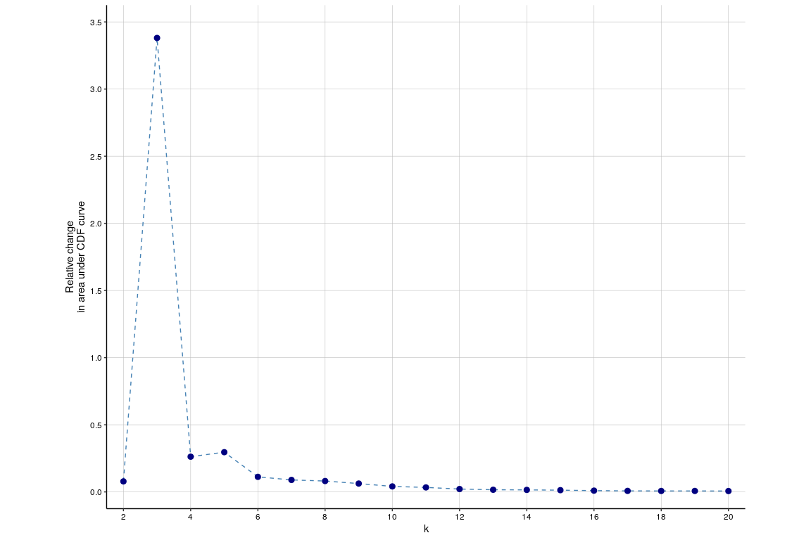

CyTOF Pipeline
================

**This README has two parts: The Shiny App and an example analysis**

# Part 1: Shiny App

The docker image for our shiny app is publicly available at [Docker
Hub](https://hub.docker.com/repository/docker/quirinmanz/cytof_pipeline).
First, make sure docker is installed on your machine. Then run

``` bash
docker pull quirinmanz/cytof_pipeline
```

If you want to use the [PBMC example
data](https://www.nature.com/articles/nbt.2317), you can download it
from our [Google
Drive](https://drive.google.com/drive/folders/19hM51eoLLEJDQ_Oz4xqMu2t9bAY9Qcyf?usp=sharing).
Then run

``` bash
mkdir myData
mv -r path/to/pbmcData myData
docker run --rm -p 3838:3838 -v /absolute/path/to/myData:/srv/cytof_pipeline/data cytof_pipeline
```

in order to connect the data folder with the downloaded data to the
repository.

If you go to localhost:3838, you can see our Shiny app.

You can also run the Shiny App in your R session with `shiny::runApp()`.
In that case, you have to restore the project library using
[renv](https://rstudio.github.io/renv/articles/renv.html):

``` r
# install.packages('renv')
renv::restore()
```

# Part 2: Example analysis

Data from human platelets of patients with chronic coronary syndrome
undergoing different therapy: dual antiplatelet therapy versus triple
antiplatelet therapy, before and after platelet activation with 10µm
TRAP. There are files of 7 patients with triple therapy and 12 patients
with dual therapy (each in two conditions). For information about how to
create a SCE object, please refer to the [CATALYST
Vignette](https://www.bioconductor.org/packages/release/bioc/html/CATALYST.html).

# Read in SCE object

This SCE object contains 10 000 cells per sample and therefore 20 000
cells per patient.

``` r
sce <- readRDS("data/platelets_small/sce.rds")
metadata(sce)$experiment_info
```

    ##          sample_id activated_baseline dual_triple patient_id n_cells
    ## 1    RPS 096A_dual                  A        dual    RPS 096   10000
    ## 2    RPS 096B_dual                  B        dual    RPS 096   10000
    ## 3    RPS 097A_dual                  A        dual    RPS 097   10000
    ## 4    RPS 097B_dual                  B        dual    RPS 097   10000
    ## 5  RPS 098A_triple                  A      triple    RPS 098   10000
    ## 6  RPS 098B_triple                  B      triple    RPS 098   10000
    ## 7  RPS 099A_triple                  A      triple    RPS 099   10000
    ## 8  RPS 099B_triple                  B      triple    RPS 099   10000
    ## 9    RPS 101A_dual                  A        dual    RPS 101   10000
    ## 10   RPS 101B_dual                  B        dual    RPS 101   10000
    ## 11   RPS 103A_dual                  A        dual    RPS 103   10000
    ## 12   RPS 103B_dual                  B        dual    RPS 103   10000
    ## 13 RPS 111A_triple                  A      triple    RPS 111   10000
    ## 14 RPS 111B_triple                  B      triple    RPS 111   10000
    ## 15 RPS 127A_triple                  A      triple    RPS 127   10000
    ## 16 RPS 127B_triple                  B      triple    RPS 127   10000
    ## 17 RPS 136A_triple                  A      triple    RPS 136   10000
    ## 18 RPS 136B_triple                  B      triple    RPS 136   10000
    ## 19   RPS 137A_dual                  A        dual    RPS 137   10000
    ## 20   RPS 137B_dual                  B        dual    RPS 137   10000
    ## 21 RPS 138A_triple                  A      triple    RPS 138   10000
    ## 22 RPS 138B_triple                  B      triple    RPS 138   10000
    ## 23   RPS 139A_dual                  A        dual    RPS 139   10000
    ## 24   RPS 139B_dual                  B        dual    RPS 139   10000
    ## 25   RPS 144A_dual                  A        dual    RPS 144   10000
    ## 26   RPS 144B_dual                  B        dual    RPS 144   10000
    ## 27   RPS 146A_dual                  A        dual    RPS 146   10000
    ## 28   RPS 146B_dual                  B        dual    RPS 146   10000
    ## 29   RPS 150A_dual                  A        dual    RPS 150   10000
    ## 30   RPS 150B_dual                  B        dual    RPS 150   10000
    ## 31   RPS 154A_dual                  A        dual    RPS 154   10000
    ## 32   RPS 154B_dual                  B        dual    RPS 154   10000

# Quality Control

``` r
CATALYST::pbMDS(
      sce,
      label_by = "patient_id", 
      color_by = "activated_baseline",
      features = NULL, # possible inputs: unique(rowData(sce)$marker_class) or NULL (to use all features)
      assay = "exprs", # possible inputs: assayNames(sce)
    ) + theme(text = element_text(size=18))
```

<!-- -->

``` r
CATALYST::plotNRS(
      sce,
      color_by = "activated_baseline",
      features = NULL,
      assay = "exprs"
    )
```

<!-- -->

``` r
CATALYST::plotExprs(
      sce,
      color_by = "activated_baseline",
      features = NULL,
      assay = "exprs"
    )  + theme(text = element_text(size=18))
```

<!-- -->

``` r
plotExprHeatmap(
      sce,
      features = NULL,
      assay = "exprs"
    )
```

<!-- -->

``` r
CATALYST::plotCounts(
    sce,
    group_by = "patient_id", # possible inputs: names(colData(sce))
    color_by = "dual_triple", # possible inputs: names(colData(sce))
    prop = FALSE # TRUE for stacked relative abundances, FALSE for total cell counts
  ) 
```

<!-- --> We can see
that sample 99 does not cluster with the other activated samples in the
MDS plot. We can also see in the expression plot, that the expressions
for 99 baseline and 99 activated are nearly the same. We therefore
exclude the patient from our analysis.

``` r
sce <- makePatientSelection(sce = sce, deselected_patients = c("RPS 099"))
```

The next step of quality control is clustering:

``` r
sce <- clusterSCE(sce)
```

    ## o running FlowSOM clustering...

    ## Building MST

    ## o running ConsensusClusterPlus metaclustering...

``` r
delta_area(sce)
```

<!-- --> Let’s have a
look at meta 7:

``` r
CATALYST::plotAbundances(sce, "meta7", group_by = "activated_baseline") +  theme(text = element_text(size=18), axis.text.x = element_text(size=12)) 
```

<!-- --> As we
can see, clusters 5,6, and 7 were mainly made because of sample 96.
Therefore, we also exclude this sample:

``` r
sce <- makePatientSelection(sce = sce, deselected_patients = c("RPS 096"))
```

We cluster again in order to see if the delta area changed and if the
cluster abundances now look good:

``` r
sce <- clusterSCE(sce)
```

    ## o running FlowSOM clustering...

    ## Building MST

    ## o running ConsensusClusterPlus metaclustering...

``` r
delta_area(sce)
```

<!-- --> We do not seem to
win much by looking at more than 7 clusters. Let’s take a look at meta7
again. We can also make a star plot to compare the marker abundances:

``` r
CATALYST::plotAbundances(sce, "meta7", group_by = "activated_baseline") +  theme(text = element_text(size=18), axis.text.x = element_text(size=12)) 
```

<!-- -->

``` r
invisible(plotStarsCustom(sce, backgroundValues = cluster_codes(sce)[["meta7"]]))
```

<!-- --> The
clustering now looks fine. We can therefore continue to do our analysis:
\# Data Visualization You can now run various dimensionality reduction
methods on your data. The options are (parameter dr\_chosen): “UMAP”,
TSNE“,”PCA“,”MDS“,”DiffusionMap" and “Isomap”.

Other run options are: cells\_chosen: number of cells to sample from

feature\_chosen: markers or marker class. We recommend using “type”

assay\_chosen: “counts” or “exprs”. We recommend using “exprs”

scale: TRUE or FALSE. We recommend using TRUE

k: Isomap-specific parameter. Specifies the number of neighbours for the
graph constructed by isomap

We try UMAP and PCA on our data and color by the expression of our state
markers:

``` r
DR_methods <- c("UMAP","PCA")

for( method in DR_methods ){
  sce <- runDimRed(sce, method, cells_chosen = 1000, feature_chosen = "type", assay_chosen = "exprs", scale = T)
}
```

    ## Warning in check_numbers(k = k, nu = nu, nv = nv, limit = min(dim(x)) - : more
    ## singular values/vectors requested than available

    ## Warning in (function (A, nv = 5, nu = nv, maxit = 1000, work = nv + 7, reorth =
    ## TRUE, : You're computing too large a percentage of total singular values, use a
    ## standard svd instead.

    ## Warning in (function (A, nv = 5, nu = nv, maxit = 1000, work = nv + 7, reorth
    ## = TRUE, : did not converge--results might be invalid!; try increasing work or
    ## maxit

``` r
state_markers <- rowData(sce)[rowData(sce)$marker_class=="state",]$marker_name
for( method in DR_methods ){
  g <- CATALYST::plotDR(sce, dr = method, color_by = state_markers, facet_by="activated_baseline") +  theme(text = element_text(size=18))
  print(g)
}
```

<!-- --><!-- -->

After clustering and visualization, we can move to the differential
expression analysis.

# Differential Expression Analysis

We are especially interested in the markers that are differentially
expressed between baseline and activation. Because we have two treatment
groups, we make the differential expression analysis in these subgroups
of patients:

## Dual Activated vs. Dual Baseline

First, we have to filter the data to only dual patients.

``` r
sce_d <- filterSCE(sce, dual_triple == "dual")
```

Before performing the differential marker expression analysis, we plot
the median marker expressions.

``` r
CATALYST::plotPbExprs(sce_d, k = "all", features = NULL , color_by = "activated_baseline",  ncol=8, facet_by = "antigen") +  theme(text = element_text(size=16))
```

<!-- -->

From this plot, we can see that our state markers CD63 and CD62P are
probably differentially expressed but the state marker CD107a has a
median marker expression of zero and the state marker CD154 just has one
outlier sample that does not have a median marker expression of zero.

We now perform out differential expression analysis with the LMM. We
include patient\_id as random effect such that the LMM can compare the
marker expressions sample-wise

``` r
res_d <- runDS(sce = sce_d,
      condition = "activated_baseline",
      de_methods = c("LMM"),
      k = "all",
      features = "all",
      markers_to_test = "all",
      random_effect = "patient_id"
      )
```

    ## Using LMM

    ## Warning in any(lapply(contrastVars, function(y) {: wandle Argument des Typs
    ## 'list' nach boolesch
    
    ## Warning in any(lapply(contrastVars, function(y) {: wandle Argument des Typs
    ## 'list' nach boolesch

    ##      [,1]
    ## [1,]    0
    ## [2,]    1

    ## using SingleCellExperiment object from CATALYST as input

    ## using cluster IDs from clustering stored in column 'all' of 'cluster_codes' data frame in 'metadata' of SingleCellExperiment object from CATALYST

    ## calculating features...

    ## calculating DS tests using method 'diffcyt-DS-LMM'...

    ## boundary (singular) fit: see ?isSingular

    ## Warning in vcov.merMod(model): Computed variance-covariance matrix problem: not a positive definite matrix;
    ## returning NA matrix

    ## Error in asMethod(object) : not a positive definite matrix

    ## boundary (singular) fit: see ?isSingular
    ## boundary (singular) fit: see ?isSingular

    ## Warning in checkConv(attr(opt, "derivs"), opt$par, ctrl = control$checkConv, :
    ## Model failed to converge with max|grad| = 0.00284889 (tol = 0.002, component 1)

Now, we can visualize that with a heatmap:

``` r
CATALYST::plotDiffHeatmap(sce_d, rowData(res_d$LMM$res), all=T, col_anno = c("activated_baseline", "patient_id"), normalize = TRUE)
```

<!-- --> As we
expected, CD62P and CD63 are differentially expressed. Additionally, the
LMM found the type markers PEAR, CD69, PAR1 and CD42a to be
differentially expressed as well.

## Triple Activated vs. Triple Baseline

We now subset our SCE object such that only the triple anticoagulation
therapy patients are included:

``` r
sce_t <- filterSCE(sce, dual_triple == "triple")
```

``` r
CATALYST::plotPbExprs(sce_t, k = "all", features = NULL , color_by = "activated_baseline",  ncol=8, facet_by = "antigen") +  theme(text = element_text(size=16))
```

<!-- --> Again,
we expect CD62P and CD63 to be differentially expressed. CD107a and
CD154 again have a median marker expression in every sample except for
one.

``` r
res_t <- runDS(sce = sce_t,
      condition = "activated_baseline",
      de_methods = c("LMM"),
      k = "all",
      features = "all",
      random_effect = "patient_id"
      )
```

    ## Using LMM

    ## Warning in any(lapply(contrastVars, function(y) {: wandle Argument des Typs
    ## 'list' nach boolesch
    
    ## Warning in any(lapply(contrastVars, function(y) {: wandle Argument des Typs
    ## 'list' nach boolesch

    ##      [,1]
    ## [1,]    0
    ## [2,]    1

    ## using SingleCellExperiment object from CATALYST as input

    ## using cluster IDs from clustering stored in column 'all' of 'cluster_codes' data frame in 'metadata' of SingleCellExperiment object from CATALYST

    ## calculating features...

    ## calculating DS tests using method 'diffcyt-DS-LMM'...

    ## boundary (singular) fit: see ?isSingular
    ## boundary (singular) fit: see ?isSingular

``` r
CATALYST::plotDiffHeatmap(sce_t, rowData(res_t$LMM$res), all=T, col_anno = c("activated_baseline", "patient_id"), normalize = TRUE)
```

<!-- --> Here, we
also find two type markers to be differentially expressed: PAR1 and
CD42a.

\#Comparison of limma and LMM for Triple A vs. B

Lastly, let’s compare which markers are found by limma and LMM:

``` r
res_triple <- runDS(sce = sce_t,
      condition = "activated_baseline",
      random_effect = "patient_id",
      de_methods = c("limma","LMM"),
      k = "all",
      features = "all")
```

    ## Using limma

    ## Warning in any(lapply(contrastVars, function(y) {: wandle Argument des Typs
    ## 'list' nach boolesch
    
    ## Warning in any(lapply(contrastVars, function(y) {: wandle Argument des Typs
    ## 'list' nach boolesch

    ##      [,1]
    ## [1,]    0
    ## [2,]    1

    ## using SingleCellExperiment object from CATALYST as input

    ## using cluster IDs from clustering stored in column 'all' of 'cluster_codes' data frame in 'metadata' of SingleCellExperiment object from CATALYST

    ## calculating features...

    ## calculating DS tests using method 'diffcyt-DS-limma'...

    ## Using LMM

    ## Warning in any(lapply(contrastVars, function(y) {: wandle Argument des Typs
    ## 'list' nach boolesch
    
    ## Warning in any(lapply(contrastVars, function(y) {: wandle Argument des Typs
    ## 'list' nach boolesch

    ##      [,1]
    ## [1,]    0
    ## [2,]    1

    ## using SingleCellExperiment object from CATALYST as input

    ## using cluster IDs from clustering stored in column 'all' of 'cluster_codes' data frame in 'metadata' of SingleCellExperiment object from CATALYST

    ## calculating features...

    ## calculating DS tests using method 'diffcyt-DS-LMM'...

    ## boundary (singular) fit: see ?isSingular
    ## boundary (singular) fit: see ?isSingular

``` r
# significant markers found by all methods:
createVennDiagram(res_triple)
```

<!-- --> limma only
finds the two state markers. When we look into the heatmap from the LMM
and the boxplots of the median marker expression, we can see why: The
difference between the median marker expressions does not look so
different overall in the boxplots. This is the only thing that limma can
evaluate. Because we tell the LMM to take the patient\_id into account
as an random effect, it compares the median marker expressions
patient-wise. In the heatmap, the patient samples are shown next to each
other. We can see that PAR1 and CD42a are downregulated for the
activated platelets in each patient but the expressions per patient
vary. This is why limma cannot find these two markers
