Differential Marker Expression Analysis
================
Arend Lis, Bernett Judith, Manz Quirin
12.01.2021

# Upload Data, Preprocessing and Clustering

If you don’t want to perform the reduction of the data (selection of
patients, sampling of cells), clustering, and the visualization methods,
you can simply skip those steps and load the data here. You can then
directly pass to the comparison of the differential marker expression
analysis
methods.

``` r
path_to_rds <- "/nfs/home/students/l.arend/data/platelets/sceSampledCellsClustered.rds"
sce <- readRDS(path_to_rds)
```

Otherwise, upload data here.

``` r
path_to_rds <- "../data/platelets/sce_transformed.rds"
sce <- readRDS(path_to_rds)
```

Make patient selection based on preprocessing plots and clustering
results

``` r
sce <- makePatientSelection(sce, deselected_patients = c("RPS 124", "RPS 108", "RPS 096", "RPS 149", "RPS 099"))
```

Sample data to 4 patients receiving dual treatment and 4 patients
receiving triple treatment

``` r
ei <- metadata(sce)$experiment_info
dual <- unique(ei[ei$dual_triple == "dual",]$patient_id)
triple <- unique(ei[ei$dual_triple == "triple",]$patient_id)

set.seed(1234)
sampled_duals <- as.character(dual[sample(length(dual), 4, replace=FALSE)])
set.seed(1234)
sampled_triples <- as.character(triple[sample(length(triple), 4, replace=FALSE)])

sampled_patients <- c(sampled_triples, sampled_duals)
sampled_patients

sce <- filterSCE(sce, patient_id %in% sampled_patients)
```

Sample data to n cells for each sample

``` r
n <- 10000

ei <- metadata(sce)$experiment_info
sample_ids <- ei$sample_id
coldata <- data.table()

coldata <- colData(sce)
rownames(coldata) <- seq(1:nrow(coldata))

sampled_indices <- c() 
for (id in sample_ids){
  dt <- coldata[coldata$sample_id == id,]
  indices <- rownames(dt)
  set.seed(1234)
  sample <- as.numeric(indices[sample(length(indices), n, replace=FALSE)])
  sampled_indices <- c(sampled_indices, sample)
}

sampled_indices <- sort(sampled_indices)

sce <- sce[,sampled_indices]

# metadata experiment_info does not update when subselecting
ei$n_cells <- rep(n, nrow(ei))
metadata(sce)$experiment_info <- ei
```

Cluster the filtered SingleCellExperiment and run dimensionality
reduction methods:

``` r
sce <- clusterSCE(sce) 

DR_methods <- c("UMAP", "TSNE", "PCA", "MDS", "DiffusionMap", "Isomap")
for( method in DR_methods ){
  print(method)
  sce <- runDimRed(sce, method, cells_chosen = 100, feature_chosen = "type", assay_chosen = "exprs", scale = T, k = 3)
}

#saveRDS(sce,"../data/platelets/sceSampledCells.rds")
```

# Comparison of Differential Marker Expression Analysis Methods

### Register Parallel Backend

``` r
library(BiocParallel)
# Set the parameters and register the back-end to be used
param <- MulticoreParam(workers = 22)
register(param)
```

### set none markers to state to check them too

``` r
none_markers <- rownames(sce)[marker_classes(sce) == "none"]

rowData(sce)$marker_class[marker_classes(sce) == "none"] <- "state"
```

## Dual Activated vs. Dual Baseline

Let’s try all possible methods on the dual samples:

``` r
# subsett SingleCellExperiment for dual patients
sce_dual <- filterSCE(sce, dual_triple == "dual")

res_dual <- suppressMessages(runDS(sce = sce_dual,
      condition = "activated_baseline",
      random_effect = "patient_id",
      de_methods = c("limma","LMM", "SigEMD", "DEsingle"),
      k = "all",
      features = "all",
      nperm = 100,
      parallel = TRUE))
```

    ## Warning in any(lapply(contrastVars, function(y) {: coercing argument of type
    ## 'list' to logical
    
    ## Warning in any(lapply(contrastVars, function(y) {: coercing argument of type
    ## 'list' to logical

    ##      [,1]
    ## [1,]    0
    ## [2,]    1

    ## Warning: Zero sample variances detected, have been offset away from zero
    
    ## Warning: coercing argument of type 'list' to logical
    
    ## Warning: coercing argument of type 'list' to logical

    ##      [,1]
    ## [1,]    0
    ## [2,]    1

    ## Warning in vcov.merMod(model): Computed variance-covariance matrix problem: not a positive definite matrix;
    ## returning NA matrix

    ## Error in asMethod(object) : not a positive definite matrix

    ## Warning in vcov.merMod(model): Computed variance-covariance matrix problem: not a positive definite matrix;
    ## returning NA matrix

    ## Error in asMethod(object) : not a positive definite matrix
    ## [1] "calculating SigEMD for cluster all"
    ## [1] "calculating DEsingle for cluster all"

``` r
# significant markers found by all methods:

createVennDiagram(res_dual)
```

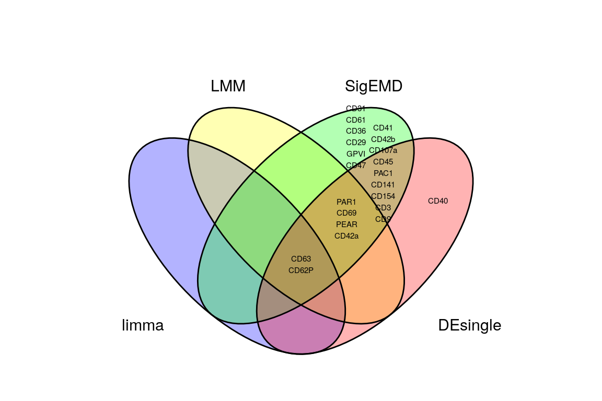<!-- -->

Let’s try to permute the labels (activated and baseline) and check the
results.

``` r
sce_dual_sampled <- sce_dual

ei <- metadata(sce_dual_sampled)$experiment_info

# sample A and B 
set.seed(1234)
condition <- sample(ei$activated_baseline)

# edit activated_baseline condition in experiment_info
ei$activated_baseline <- condition
metadata(sce_dual_sampled)$experiment_info <- ei

# edit activated_baseline in colData (not corrected in sample name)
coldata_condition <- rep(condition, times=ei$n_cells)
colData(sce_dual_sampled)$activated_baseline <- as.factor(coldata_condition)

res_dual_sampled <- suppressMessages(runDS(sce = sce_dual_sampled,
      condition = "activated_baseline",
      random_effect = "patient_id",
      de_methods = c("limma","LMM", "SigEMD", "DEsingle"),
      k = "all",
      features = "all",
      nperm = 100,
      parallel = TRUE))
```

    ## Warning in any(lapply(contrastVars, function(y) {: coercing argument of type
    ## 'list' to logical
    
    ## Warning in any(lapply(contrastVars, function(y) {: coercing argument of type
    ## 'list' to logical

    ##      [,1]
    ## [1,]    0
    ## [2,]    1

    ## Warning: Zero sample variances detected, have been offset away from zero
    
    ## Warning: coercing argument of type 'list' to logical
    
    ## Warning: coercing argument of type 'list' to logical

    ##      [,1]
    ## [1,]    0
    ## [2,]    1

    ## Warning in checkConv(attr(opt, "derivs"), opt$par, ctrl = control$checkConv, :
    ## Model failed to converge with max|grad| = 0.00242888 (tol = 0.002, component 1)

    ## Warning in checkConv(attr(opt, "derivs"), opt$par, ctrl = control$checkConv, :
    ## Model failed to converge with max|grad| = 0.00498642 (tol = 0.002, component 1)

    ## Warning in checkConv(attr(opt, "derivs"), opt$par, ctrl = control$checkConv, :
    ## Model failed to converge with max|grad| = 0.00206121 (tol = 0.002, component 1)

    ## Warning in checkConv(attr(opt, "derivs"), opt$par, ctrl = control$checkConv, :
    ## Model failed to converge with max|grad| = 0.0048657 (tol = 0.002, component 1)

    ## Warning in vcov.merMod(model): Computed variance-covariance matrix problem: not a positive definite matrix;
    ## returning NA matrix

    ## Error in asMethod(object) : not a positive definite matrix

    ## Warning in vcov.merMod(model): Computed variance-covariance matrix problem: not a positive definite matrix;
    ## returning NA matrix

    ## Error in asMethod(object) : not a positive definite matrix

    ## Warning in checkConv(attr(opt, "derivs"), opt$par, ctrl = control$checkConv, :
    ## Model failed to converge with max|grad| = 0.00323565 (tol = 0.002, component 1)

    ## Warning in checkConv(attr(opt, "derivs"), opt$par, ctrl = control$checkConv, :
    ## Model failed to converge with max|grad| = 0.00405458 (tol = 0.002, component 1)

    ## Warning in checkConv(attr(opt, "derivs"), opt$par, ctrl = control$checkConv, :
    ## Model failed to converge with max|grad| = 0.00406265 (tol = 0.002, component 1)

    ## [1] "calculating SigEMD for cluster all"
    ## [1] "calculating DEsingle for cluster all"

``` r
createVennDiagram(res_dual_sampled)
```

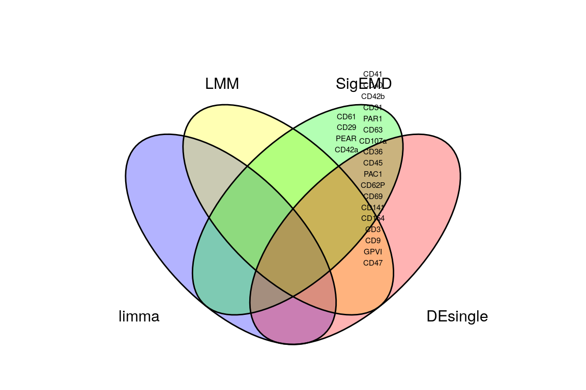<!-- -->

Something is fishy with SigEMD and DEsingle.

Let’s permute labels per sample opposed to per event (what SigEMD does
internally):

``` r
res_perm_samples <- suppressMessages(SigEMD(sce_dual, "all", "activated_baseline", Hur_gene = rownames(sce_dual), nperm = 100, parallel = TRUE, permute_samples = TRUE))
```

    ## [1] "calculating SigEMD for cluster all"

``` r
res_perm_samples$overall <- data.table::rbindlist(lapply(res_perm_samples, function(x) x$emdall))
res_dual$SigEMD <- res_perm_samples

createVennDiagram(res_dual)
```

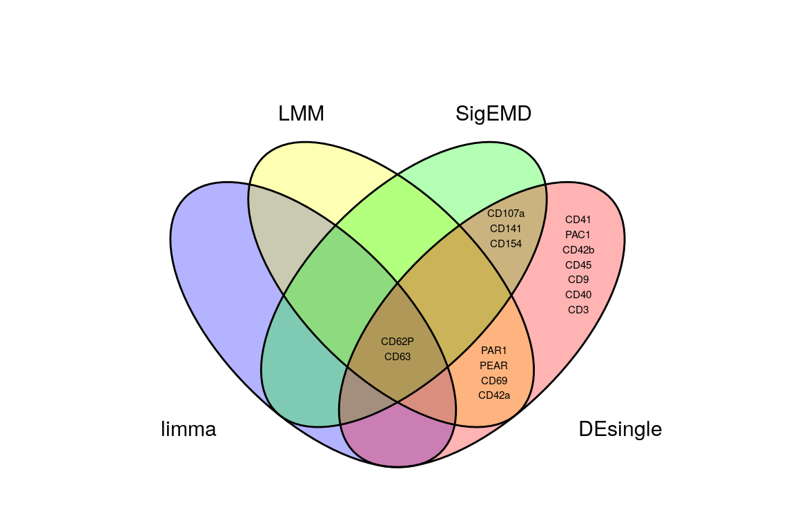<!-- -->

Show heatmaps of the different
methods:

``` r
CATALYST::plotDiffHeatmap(sce_dual, rowData(res_dual$limma$res), all=TRUE, k="all")
```

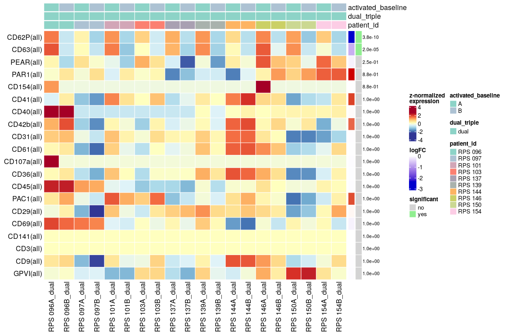<!-- -->

``` r
CATALYST::plotDiffHeatmap(sce_dual, rowData(res_dual$LMM$res), all=TRUE, k="all")
```

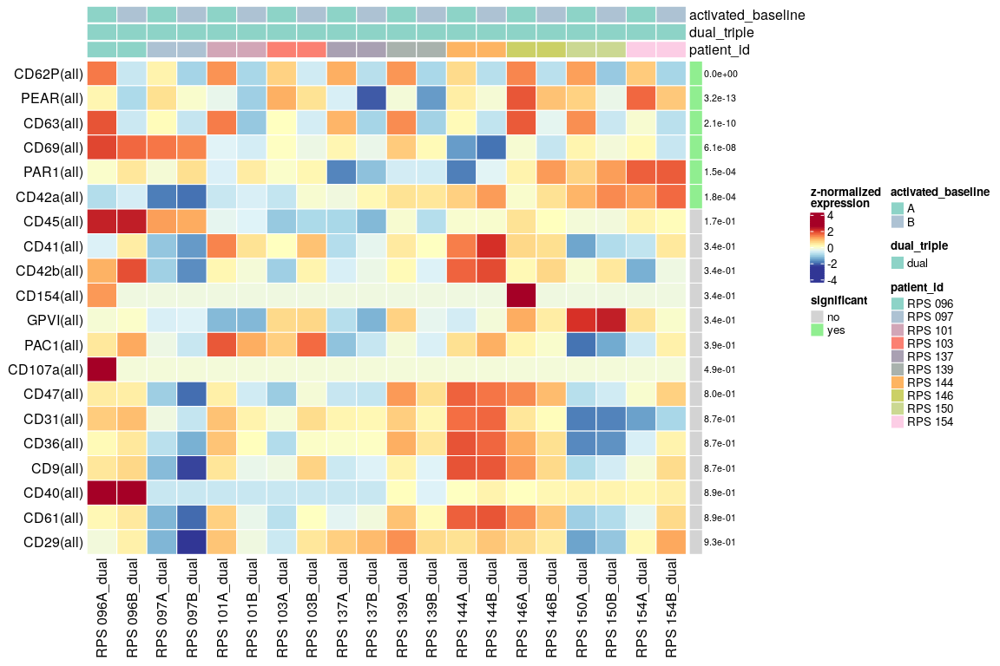<!-- -->

``` r
CATALYST::plotDiffHeatmap(sce_dual, res_dual$SigEMD$overall, all=TRUE, k="all")
```

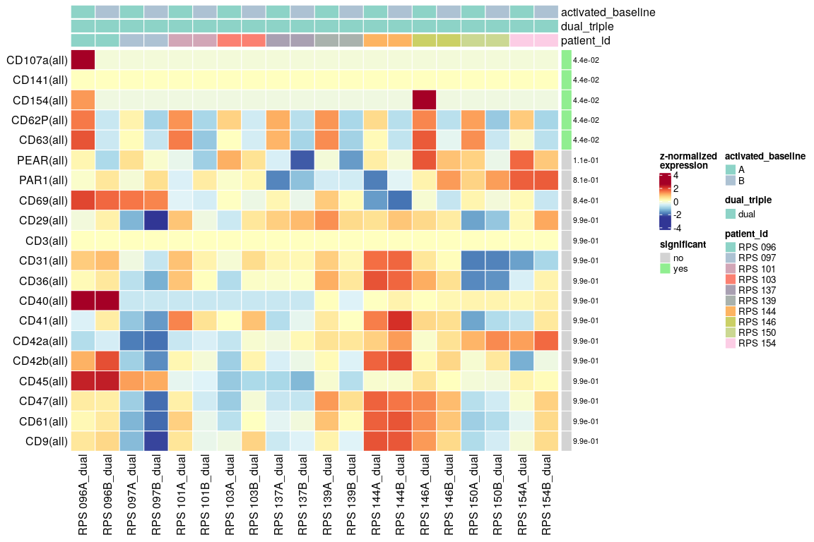<!-- -->

``` r
CATALYST::plotDiffHeatmap(sce_dual, res_dual$DEsingle, all=TRUE, k="all")
```

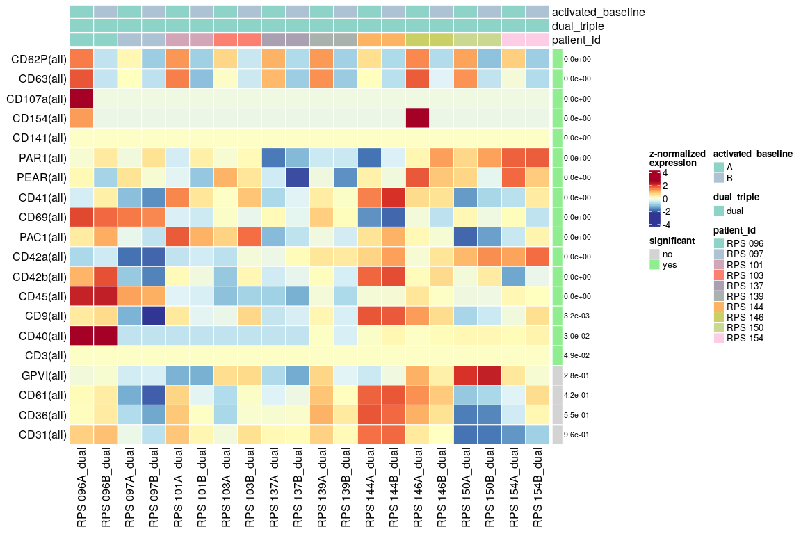<!-- -->

Let’s check the difference between running SigEMD with or without
logistic
regression:

``` r
timed1 <- system.time(emd_result <- SigEMD(sce_dual, "all", "activated_baseline", nperm=1, parallel=TRUE, permute_samples = TRUE))
```

    ## [1] "calculating SigEMD for cluster all"

    ## Remove genes that all are zeros...

    ## done

    ## do EMD for Hur genes.

    ## Calculating pairwise emd scores...done.
    ## Calculating emd...done.
    ## Calculating permuted emd #1 of 1...done.
    ## Calculating q-values...done.
    ## do EMD for nonHur genes.
    ## calculate emd for each gene...done
    ## calculate emd.perm...done
    ## calculate q-value...done
    ## Permutation number: 1
    ## do EMD for Hur genes.
    ## Calculating pairwise emd scores...done.
    ## Calculating emd...done.
    ## Calculating permuted emd #1 of 1...done.
    ## Calculating q-values...done.
    ## do EMD for nonHur genes.
    ## calculate emd for each gene...done
    ## calculate emd.perm...done
    ## calculate q-value...done

``` r
#     user   system  elapsed 
# 4346.330 1598.441 2182.108 
print(timed1)
```

    ##    user  system elapsed 
    ## 122.295  13.979 117.786

``` r
emd_result <- emd_result$all
source("../SigEMD/plot_sig.R")
#lapply(state_markers(sce_dual), function(marker) plot_emd_density_sig(emd_result, marker))
```

``` r
# now check if what happens if we skip the logistic regression
timed <- system.time(emd_result_allHur <- SigEMD(sce_dual, "all", "activated_baseline", Hur_gene=rownames(sce_dual), nperm=1, parallel=TRUE, permute_samples = TRUE))
```

    ## [1] "calculating SigEMD for cluster all"

    ## Remove genes that all are zeros...

    ## done

    ## do EMD for Hur genes.

    ## Calculating pairwise emd scores...done.
    ## Calculating emd...done.
    ## Calculating permuted emd #1 of 1...done.
    ## Calculating q-values...done.
    ## Permutation number: 1
    ## do EMD for Hur genes.
    ## Calculating pairwise emd scores...done.
    ## Calculating emd...done.
    ## Calculating permuted emd #1 of 1...done.
    ## Calculating q-values...done.

``` r
print(timed)
```

    ##    user  system elapsed 
    ##  20.453  17.393   8.872

``` r
emd_result_allHur <- emd_result_allHur$all
lapply(emd_result$nonHur_gene, function(marker) plot_emd_density_sig(emd_result, marker))
```

    ## [[1]]

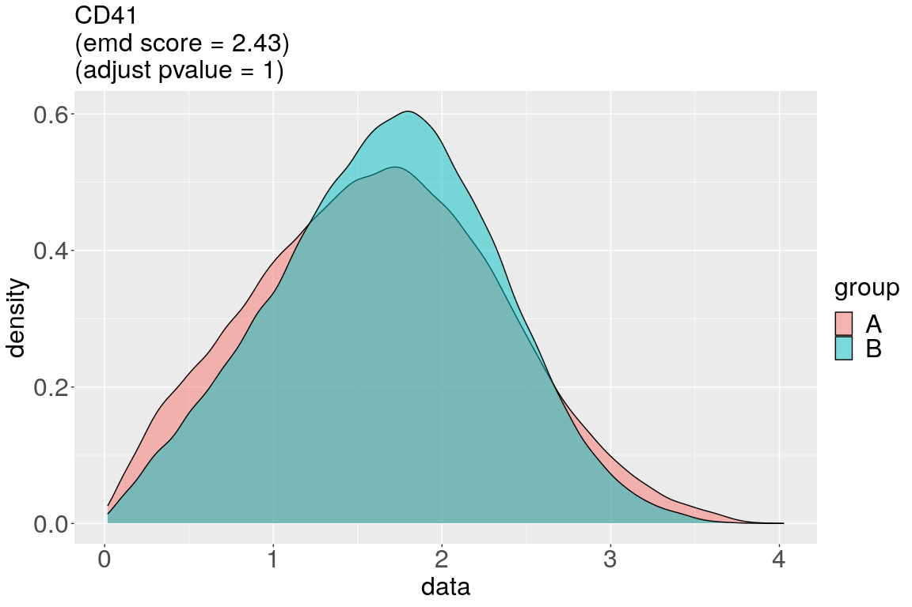<!-- -->

    ## 
    ## [[2]]

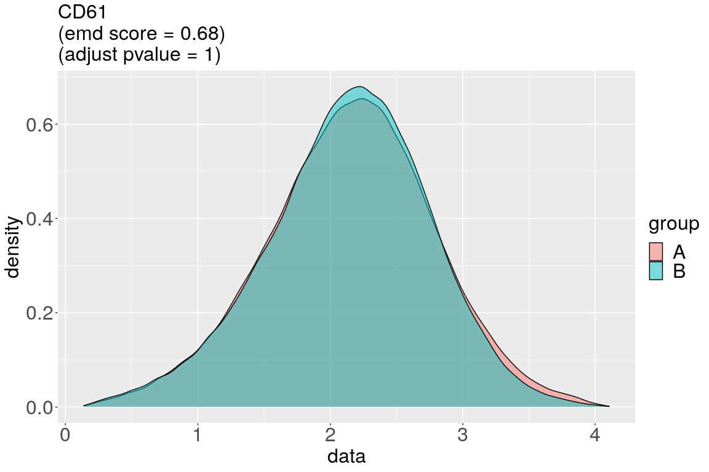<!-- -->

    ## 
    ## [[3]]

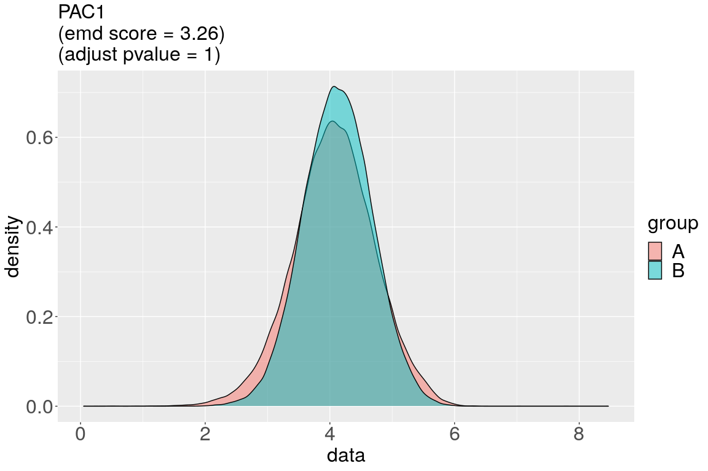<!-- -->

    ## 
    ## [[4]]

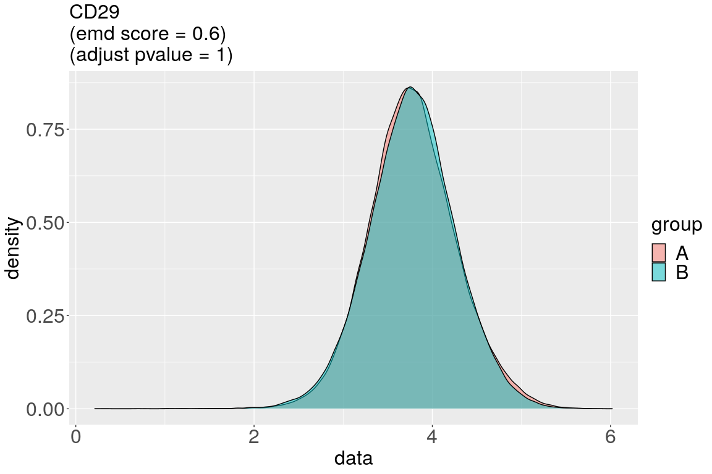<!-- -->

    ## 
    ## [[5]]

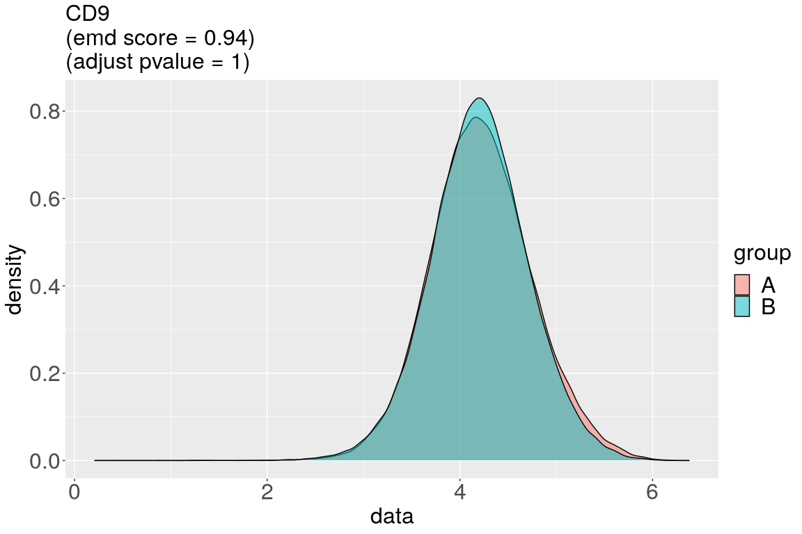<!-- -->

    ## 
    ## [[6]]

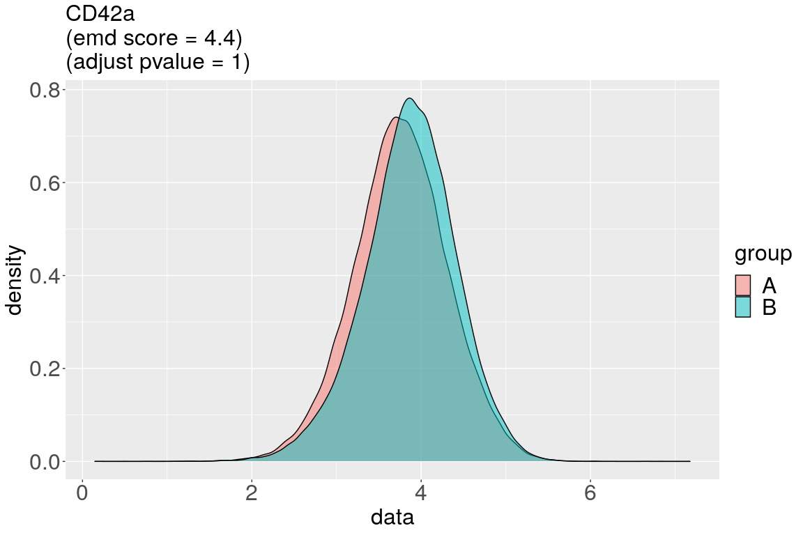<!-- -->

``` r
# How much did the zeros contribute?
print(emd_result$emdall[marker_id %in% emd_result$nonHur_gene, .(marker_id, emd)][emd_result_allHur$emdall[marker_id %in% emd_result$nonHur_gene, .(marker_id, emd_with_zeros = emd)], on = "marker_id"][order(-emd)])
```

    ##    marker_id       emd emd_with_zeros
    ## 1:     CD42a 4.3999605      4.3999605
    ## 2:      PAC1 3.2615695      3.2672100
    ## 3:      CD41 2.4277000      2.4277000
    ## 4:       CD9 0.9357975      0.9357600
    ## 5:      CD61 0.6756299      0.6756299
    ## 6:      CD29 0.6001780      0.6001599

``` r
#print(emd_result_allHur$emdall[marker_id %in% emd_result$nonHur_gene, .(emd_no_zeros = emd)])
```

<!-- Interesting about DEsingle: permuting per event gives less DE markers. -->

<!-- ```{r, eval=FALSE} -->

<!-- library(DEsingle) -->

<!-- sce_desingle <- sce_dual_ab -->

<!-- new_counts <- assay(sce_desingle, "exprs") -->

<!-- new_counts <- (abs(new_counts)+new_counts)/2 -->

<!-- assay(sce_desingle, "counts") <- new_counts -->

<!-- group <- colData(sce_dual_ab)[["activated_baseline"]] -->

<!-- results <- DEsingle::DEsingle(sce_desingle, group, parallel = TRUE) -->

<!-- results.classified <- DEtype(results = results, threshold = 0.05) -->

<!-- results.classified -->

<!-- set.seed(1234) -->

<!-- results_permuted <- DEsingle::DEsingle(sce_desingle, sample(group), parallel = TRUE) -->

<!-- results_permuted.classified <- DEtype(results = results_permuted, threshold = 0.05) -->

<!-- results_permuted.classified -->

<!-- ``` -->

## Triple Activated vs. Triple Baseline

Let’s try all possible methods on the triple samples:

``` r
sce_triple <- filterSCE(sce, dual_triple == "triple")

res_triple <- suppressMessages(runDS(sce = sce_triple,
      condition = "activated_baseline",
      random_effect = "patient_id",
      de_methods = c("limma", "LMM", "SigEMD", "DEsingle"),
      k = "all",
      features = "all",
      nperm = 200,
      permute_samples = TRUE,
      parallel = TRUE))
```

    ## Warning in any(lapply(contrastVars, function(y) {: coercing argument of type
    ## 'list' to logical
    
    ## Warning in any(lapply(contrastVars, function(y) {: coercing argument of type
    ## 'list' to logical

    ##      [,1]
    ## [1,]    0
    ## [2,]    1

    ## Warning: Zero sample variances detected, have been offset away from zero
    
    ## Warning: coercing argument of type 'list' to logical
    
    ## Warning: coercing argument of type 'list' to logical

    ##      [,1]
    ## [1,]    0
    ## [2,]    1

    ## Warning in checkConv(attr(opt, "derivs"), opt$par, ctrl = control$checkConv, :
    ## Model failed to converge with max|grad| = 0.00775599 (tol = 0.002, component 1)

    ## Warning in checkConv(attr(opt, "derivs"), opt$par, ctrl = control$checkConv, :
    ## Model failed to converge with max|grad| = 0.0330153 (tol = 0.002, component 1)

    ## Warning in vcov.merMod(model): Computed variance-covariance matrix problem: not a positive definite matrix;
    ## returning NA matrix

    ## Error in asMethod(object) : not a positive definite matrix

    ## Warning in vcov.merMod(model): Computed variance-covariance matrix problem: not a positive definite matrix;
    ## returning NA matrix

    ## Error in asMethod(object) : not a positive definite matrix

    ## Warning in checkConv(attr(opt, "derivs"), opt$par, ctrl = control$checkConv, :
    ## Model failed to converge with max|grad| = 0.00221719 (tol = 0.002, component 1)

    ## [1] "calculating SigEMD for cluster all"

    ## Warning in selectChildren(jobs, timeout): error 'No child processes' in select

    ## Warning in selectChildren(jobs, timeout): error 'No child processes' in select
    
    ## Warning in selectChildren(jobs, timeout): error 'No child processes' in select
    
    ## Warning in selectChildren(jobs, timeout): error 'No child processes' in select

    ## [1] "calculating DEsingle for cluster all"
    ## 
    ## 
    ##  1 gene failed.

``` r
# significant markers found by all methods:
createVennDiagram(res_triple)
```

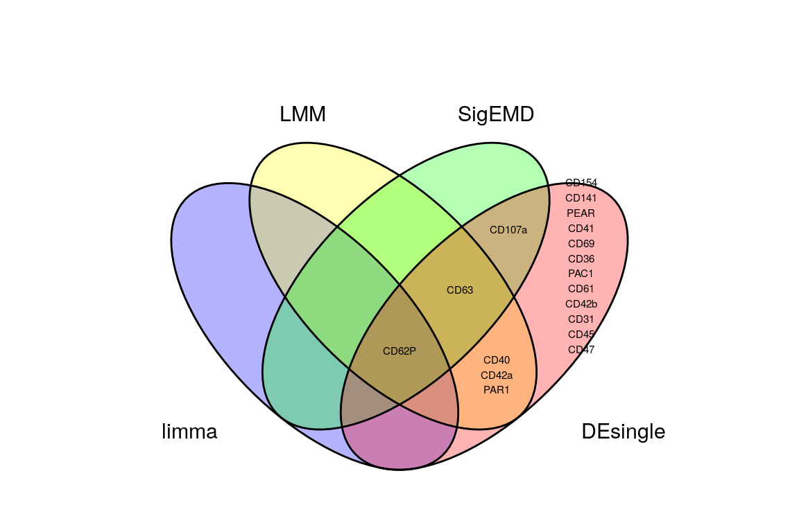<!-- -->

## Dual Activated vs. Triple Activated

Let’s try all possible methods on the A samples:

``` r
sce_a <- filterSCE(sce, activated_baseline == "A")

res_a <- suppressMessages(runDS(sce = sce_a,
      condition = "dual_triple",
      de_methods = c("limma", "LMM", "SigEMD", "DEsingle"),
      k = "all",
      features = "all",
      nperm = 200,
      permute_samples = TRUE,
      parallel = TRUE))
```

    ## Warning in any(lapply(contrastVars, function(y) {: coercing argument of type
    ## 'list' to logical
    
    ## Warning in any(lapply(contrastVars, function(y) {: coercing argument of type
    ## 'list' to logical

    ##      [,1]
    ## [1,]    0
    ## [2,]    1

    ## Warning: Zero sample variances detected, have been offset away from zero
    
    ## Warning: coercing argument of type 'list' to logical
    
    ## Warning: coercing argument of type 'list' to logical

    ##      [,1]
    ## [1,]    0
    ## [2,]    1

    ## Warning in cov2cor(covm): diag(.) had 0 or NA entries; non-finite result is
    ## doubtful

    ## Warning in cov2cor(covm): diag(.) had 0 or NA entries; non-finite result is
    ## doubtful

    ## [1] "calculating SigEMD for cluster all"

    ## Warning in selectChildren(jobs, timeout): error 'No child processes' in select

    ## Warning in selectChildren(jobs, timeout): error 'No child processes' in select

    ## [1] "calculating DEsingle for cluster all"

``` r
# Significant markers found by all methods:
createVennDiagram(res_a)
```

<!-- -->

## Dual Baseline vs. Triple Basleline

Let’s try all possible methods on the B samples:

``` r
sce_b <- filterSCE(sce, activated_baseline == "B")

res_b <- suppressMessages(runDS(sce = sce_b,
      condition = "dual_triple",
      de_methods = c("limma", "LMM", "SigEMD", "DEsingle"),
      k = "all",
      features = "all",
      nperm = 200,
      permute_samples = TRUE,
      parallel = TRUE))
```

    ## Warning in any(lapply(contrastVars, function(y) {: coercing argument of type
    ## 'list' to logical
    
    ## Warning in any(lapply(contrastVars, function(y) {: coercing argument of type
    ## 'list' to logical

    ##      [,1]
    ## [1,]    0
    ## [2,]    1

    ## Warning: Zero sample variances detected, have been offset away from zero
    
    ## Warning: coercing argument of type 'list' to logical
    
    ## Warning: coercing argument of type 'list' to logical

    ##      [,1]
    ## [1,]    0
    ## [2,]    1

    ## Warning in cov2cor(covm): diag(.) had 0 or NA entries; non-finite result is
    ## doubtful

    ## Warning in cov2cor(covm): diag(.) had 0 or NA entries; non-finite result is
    ## doubtful
    
    ## Warning in cov2cor(covm): diag(.) had 0 or NA entries; non-finite result is
    ## doubtful
    
    ## Warning in cov2cor(covm): diag(.) had 0 or NA entries; non-finite result is
    ## doubtful

    ## [1] "calculating SigEMD for cluster all"

    ## Warning in selectChildren(jobs, timeout): error 'No child processes' in select

    ## Warning in selectChildren(jobs, timeout): error 'No child processes' in select
    
    ## Warning in selectChildren(jobs, timeout): error 'No child processes' in select
    
    ## Warning in selectChildren(jobs, timeout): error 'No child processes' in select
    
    ## Warning in selectChildren(jobs, timeout): error 'No child processes' in select
    
    ## Warning in selectChildren(jobs, timeout): error 'No child processes' in select
    
    ## Warning in selectChildren(jobs, timeout): error 'No child processes' in select
    
    ## Warning in selectChildren(jobs, timeout): error 'No child processes' in select
    
    ## Warning in selectChildren(jobs, timeout): error 'No child processes' in select

    ## [1] "calculating DEsingle for cluster all"

``` r
# Significant markers found by all methods:
createVennDiagram(res_b)
```

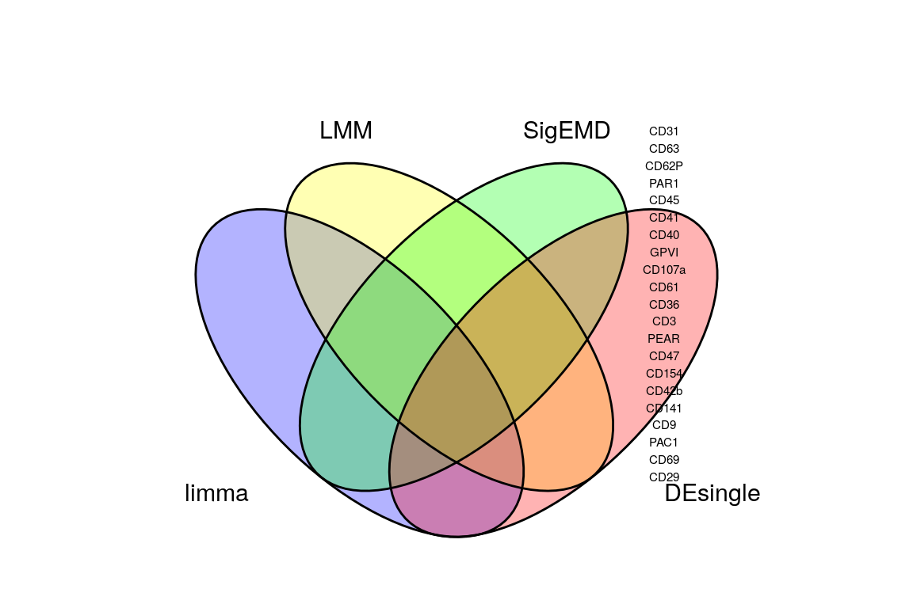<!-- --> \`\`\`
