Analysis of Platelet Data
================

\*\*This file contains the analysis of the platelet data including the
quality control of the data, the comparison of activated and baseline
conditions as well as the comparison of dual and triple antiplatelet
therapies.

Data from human platelets of patients with chronic coronary syndrome
undergoing different therapy: dual antiplatelet therapy versus triple
antiplatelet therapy, before and after platelet activation with 10µm
TRAP. There are files of 7 patients with triple therapy and 12 patients
with dual therapy (each in two condtions).

# 1\. Data Upload

Fcs files, as well as metadata and a panel file are given for this
dataset and uploaded in this section. You just have to specify the path
to your files. The Single Cell Experiment is then created using the
prepData function of CATALYST. The function prepData can directly
transform the marker intesities using arcsinh (inverse hyerpoblic sine)
to make the distributions more symmetric and to map them to a comparable
range of expression. Recommended values for the cofactor parameter are 5
for mass cytometry (CyTOF) or 150 for fluorescence flow
cytometry.

``` r
path <- "/Users/lisiarend/Desktop/Uni/Master/SysBioMed/CyTOF/extdata/HumanPlatelets"
cofactor <- 5
exp <-list.files(path,pattern = "\\.fcs$",full.names = T)#[1:14]
names <- list.files(path,pattern = "*.fcs")#[1:14]
samples <-sapply(names, function(x) {
    strsplit(x, split = ".fcs")[[1]]
  })
patients <-sapply(names, function(x) {
    str_sub(strsplit(x, split = "_")[[1]][1], end = -2)
  })
a_b <- sapply(names, function(x) {
    str_sub(strsplit(x, split = "_")[[1]][1], start = 8)
  })
dual_triple <-
  sapply(names, function(x) {
    strsplit(strsplit(x, split = "_")[[1]][2], split = ".fcs")[[1]][1]
  })
metadata <- data.table(
  "file_name" = names,
  "sample_id" = samples,
  "patient_id" = patients,
  "activated_baseline" = a_b,
  "dual_triple" = dual_triple
)
panel <-read_excel(paste0(path,"panel_platelets.xlsx"))
sce <-
  prepData(
    exp,
    panel,
    metadata,
    transform = TRUE,
    cofactor = cofactor,
    md_cols = list(
      file = "file_name",
      id = "sample_id",
      factors = c("activated_baseline", "dual_triple","patient_id")
    )
  )
```

Otherwise, you can load the “sce\_transformed.rds” file which already
contains the transformed
SingleCellExperiment.

``` r
path_to_rds <- "/nfs/home/students/ga89koc/hiwi/cytof/data/platelets/sce_transformed.rds"
sce <- readRDS(path_to_rds)
```

# Quality Control

The shiny app includes some simple visualization plots to verify whether
the data represents what we expect, for example, whether samples that
are replicates of one condition are more similar and are distinct from
samples from another condition. Depending on the situation, one can then
consider removing problematic markers or samples from further analysis.

``` r
CATALYST::plotCounts(
    sce,
    group_by = "patient_id", # possible inputs: names(colData(sce))
    color_by = "dual_triple", # possible inputs: names(colData(sce))
    prop = FALSE # TRUE for stacked relative abundances, FALSE for total cell counts
  ) 
```

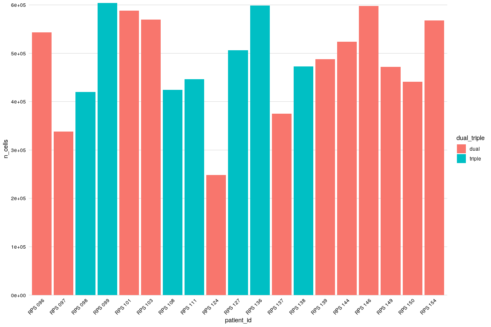<!-- -->

``` r
CATALYST::pbMDS(
      sce,
      label_by = "patient_id", 
      color_by = "activated_baseline",
      features = NULL, # possible inputs: unique(rowData(sce)$marker_class) or NULL (to use all features)
      assay = "exprs", # possible inputs: assayNames(sce)
    ) + theme(text = element_text(size=18))
```

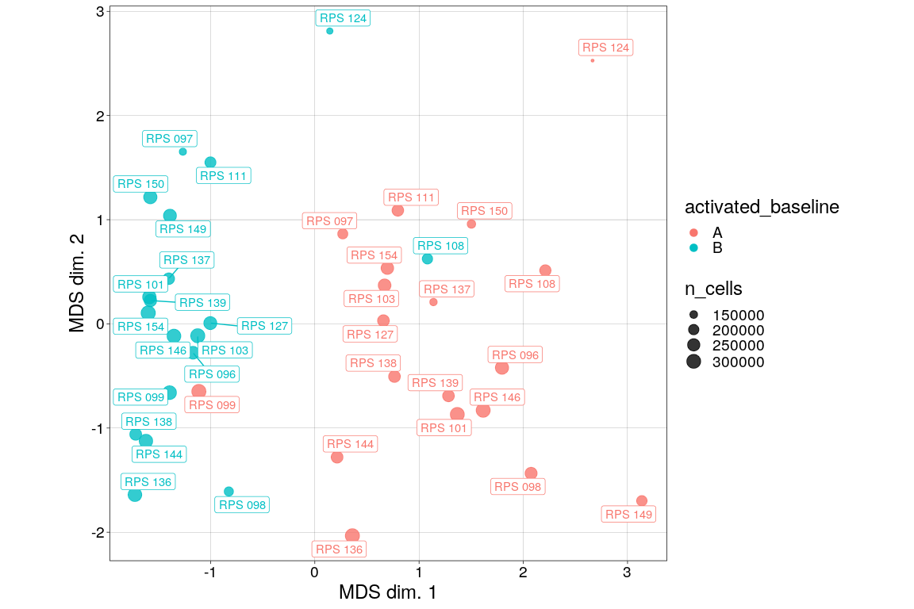<!-- -->

``` r
CATALYST::plotNRS(
      sce,
      color_by = "activated_baseline",
      features = NULL,
      assay = "exprs"
    )
```

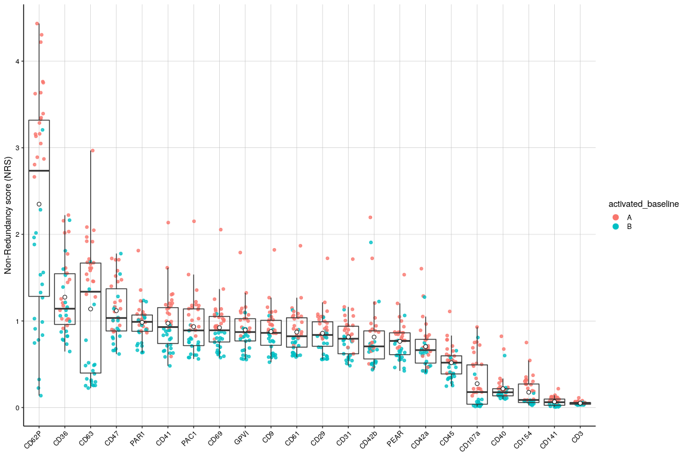<!-- -->

``` r
plotExprHeatmap(
      sce,
      features = NULL,
      assay = "exprs"
    )
```

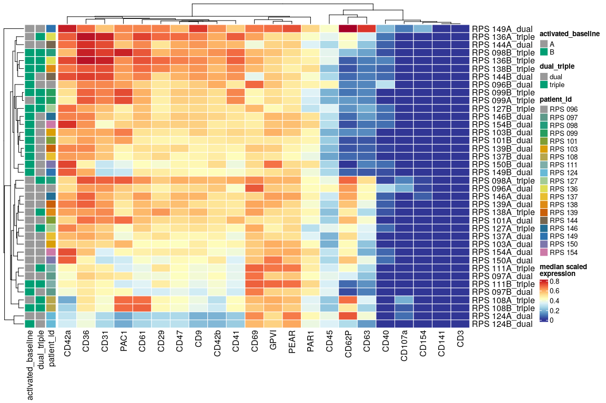<!-- -->

These plots can then be used to select patients and filter the Single
Cell Experiment. As one can see, the number of cells in patient RPS124
is notably lower than in the other patients.

Additionally, the multidimensional scaling plot shows which samples
cluster well within the same condition. On the first dimension, one can
see that the two conditions activated and baseline are reasonably well
separated. However, there are some outlier samples detected. Samples A
and B of patient 108 and patient 99 are very similar and can’t be
clearly separated into two conditions. Taking into account the second
dimension, which represents the dissimilarities between patients, we can
see that patient 124 is very far away of the other samples and should
thus be excluded for further analysis.

The expression heatmap agrees with our observations. In addition to
patient 124, 108 and 99, one should take into account to exclude patient
149 because of its A sample. The sample 149\_A shows are strang
expression over all markers and is added in the hierarchical clustering
at a very high distance. This concludes that sample 149\_A is very
dissimilar to the others.

In our workflow, we perform FlowSOM and ConsensusClusterPlus because
they appeared amongst the fastest and best performing clustering
approaches in recent studies.

``` r
sce <- clusterSCE(sce)
```

    ## o running FlowSOM clustering...

    ## Building MST

    ## o running ConsensusClusterPlus metaclustering...

``` r
delta_area(sce)
```

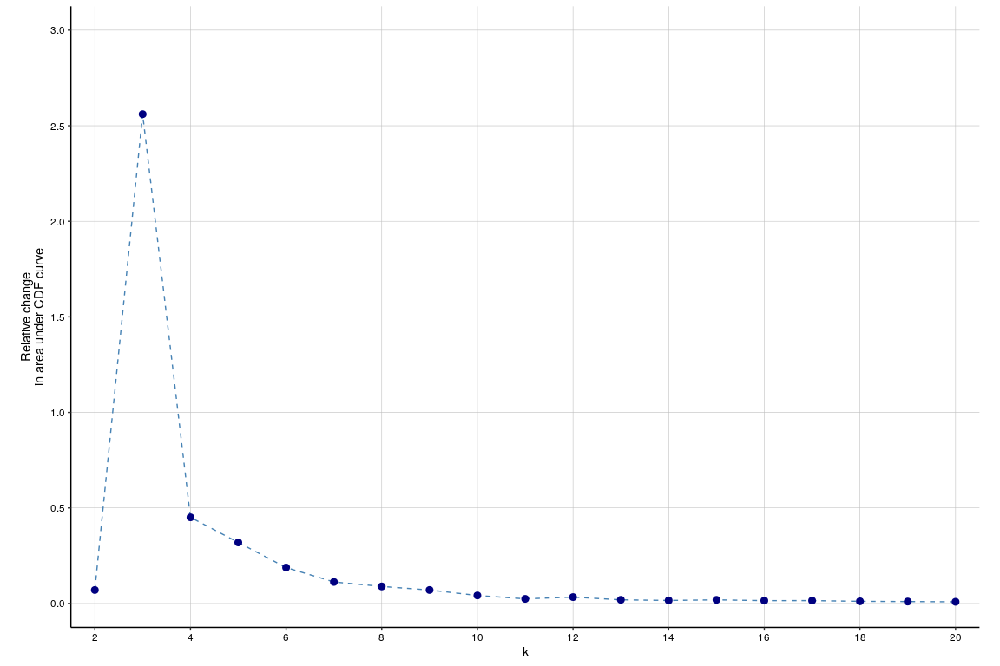<!-- -->

The delta area represents the amount of extra cluster stability gained
when clustering into k groups as compared to k-1 groups. The “natural”
number of clusters present in the data should thus corresponds to the
value of k where there is no longer a considerable increase in stability
(plateau onset).

We have chosen meta7, because at meta7 the plateau is reached and the
proportions of cells in the clusters are not too small.

Let’s have a look at the
clusters:

``` r
CATALYST::plotAbundances(sce, "meta7", group_by = "activated_baseline") +  theme(text = element_text(size=18), axis.text.x = element_text(size=12)) 
```

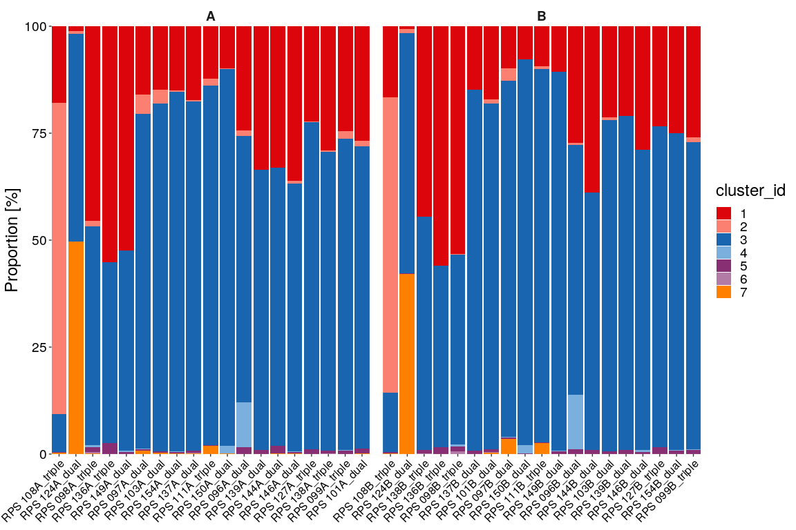<!-- -->

As we can see above, some patients have odd clusters. Further
investigation might be necessary to uncover the reasons for that. For
now we will exclude the patients RPS108, RPS096, RPS149, RPS124 and
RPS099 from the analysis. Hence, we will repeat the clustering
step:

``` r
sce <- makePatientSelection(sce = sce, deselected_patients = c("RPS 108", "RPS 096", "RPS 149", "RPS 124", "RPS 099"))
sce <- clusterSCE(sce)
```

    ## o running FlowSOM clustering...

    ## Building MST

    ## o running ConsensusClusterPlus metaclustering...

``` r
delta_area(sce)
```

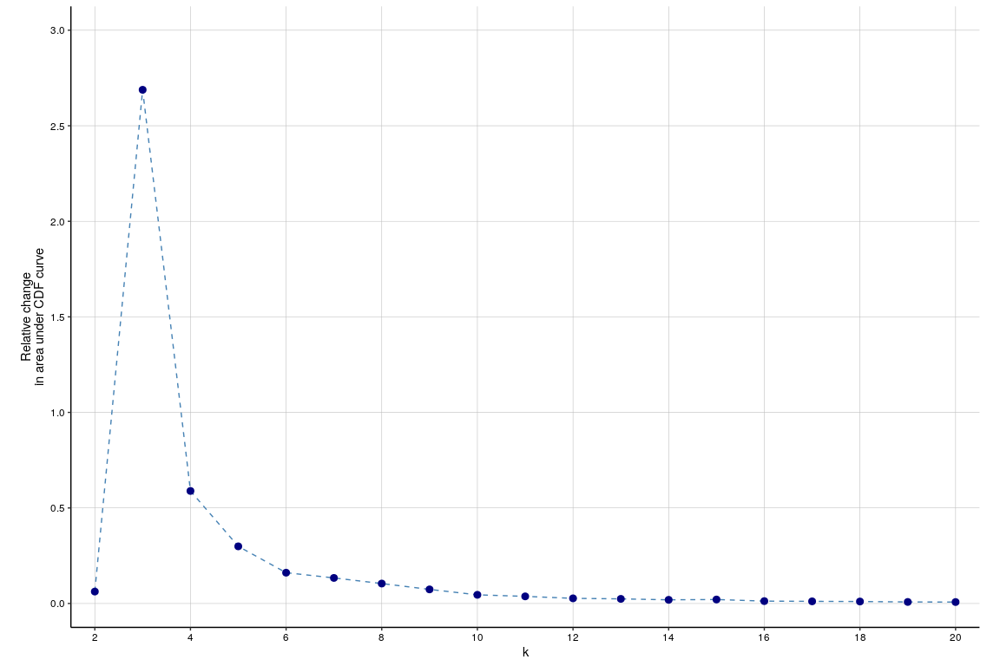<!-- -->

Let’s have a look at the clusters of
meta7:

``` r
CATALYST::plotAbundances(sce, "meta7", group_by = "activated_baseline") +  theme(text = element_text(size=18), axis.text.x = element_text(size=12)) 
```

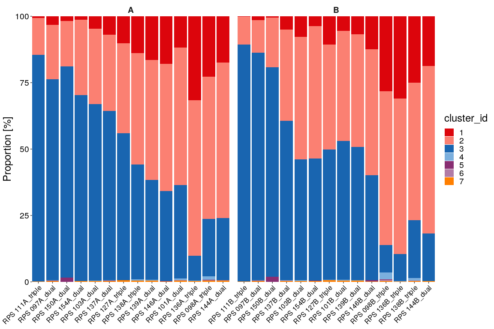<!-- -->

``` r
CATALYST::plotAbundances(sce, "meta7", by = "cluster_id", shape_by = "patient_id", group_by = "activated_baseline")
```

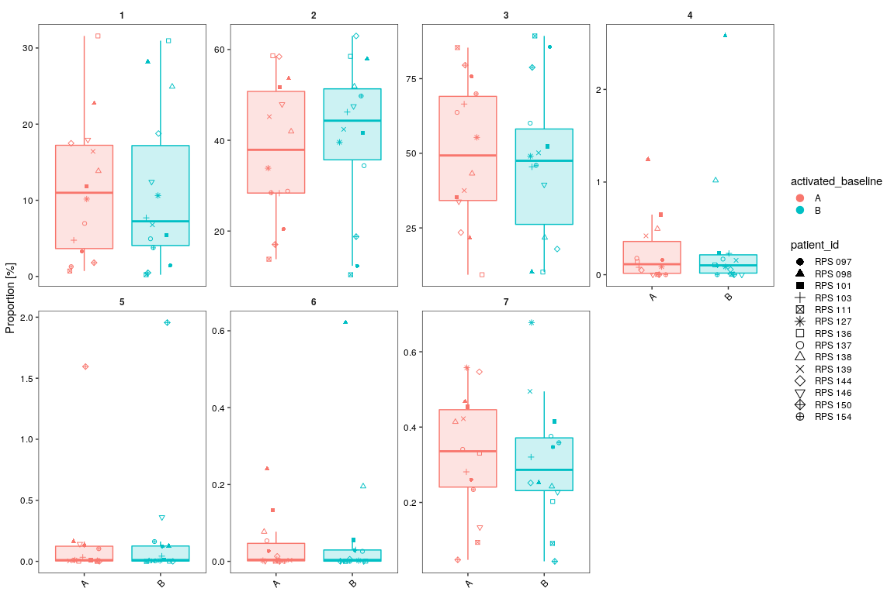<!-- -->

``` r
invisible(plotStarsCustom(sce, backgroundValues = cluster_codes(sce)[["meta7"]]))
```

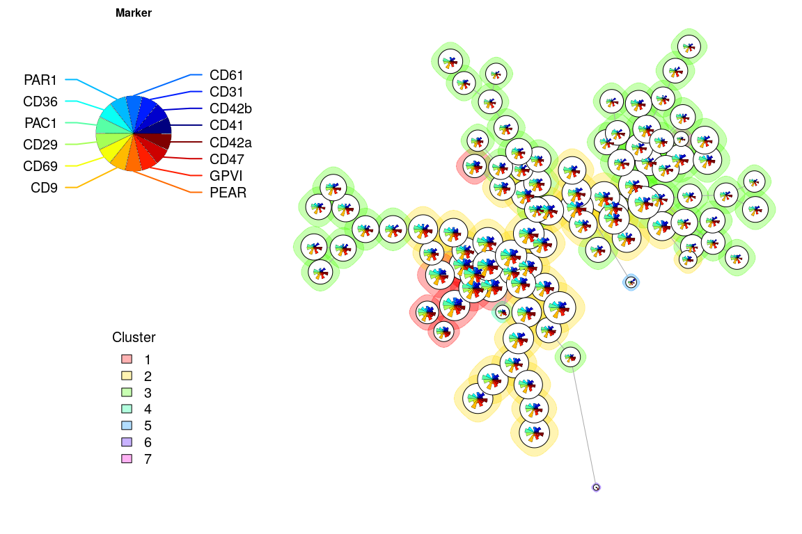<!-- -->

``` r
CATALYST::plotClusterExprs(sce, "meta7") +  theme(text = element_text(size=18)) 
```

    ## Picking joint bandwidth of 0.0569

    ## Picking joint bandwidth of 0.0582

    ## Picking joint bandwidth of 0.0557

    ## Picking joint bandwidth of 0.0485

    ## Picking joint bandwidth of 0.0511

    ## Picking joint bandwidth of 0.0751

    ## Picking joint bandwidth of 0.0573

    ## Picking joint bandwidth of 0.0467

    ## Picking joint bandwidth of 0.0503

    ## Picking joint bandwidth of 0.0502

    ## Picking joint bandwidth of 0.0462

    ## Picking joint bandwidth of 0.044

    ## Picking joint bandwidth of 0.0607

    ## Picking joint bandwidth of 0.054

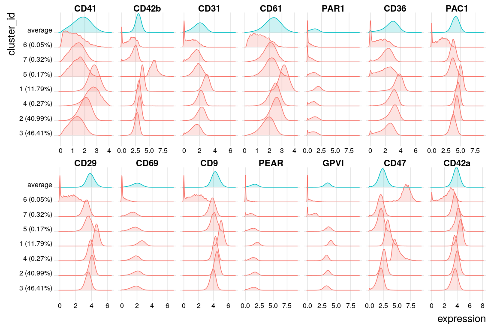<!-- -->

``` r
CATALYST::plotFreqHeatmap(sce, "meta7")
```

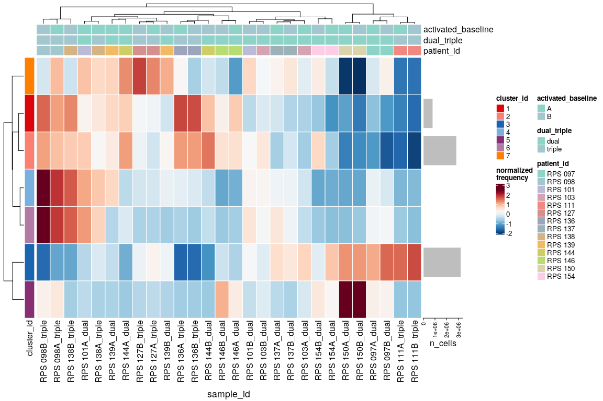<!-- -->
After filtering, the deviations in the relative population abundances
for meta7 are removed. Taking a deeper look into the smoothed densities
of marker intensities by cluster, we can see which markers are
responsible for the individual clusters. The red densities represent
marker expression for cells in a given cluster. And the blue densities
are calculated over all the cells and serve as a reference.

Comparing for example, cluster 5 and 7 (so the second and third red
densities), we can see that CD42B is responsible for the partition of
both clusters. If we would now reduce 7 clustersto meta6, the small
clusters would remain and bigger clusters like cluster 2 and 3 would get
merged together because they are more similar.

Finally, the quality control of the data is completed and data is ready
for further analysis.

# 2\. Activated vs. Baseline

First, we are going to compare activated vs. baseline platelets in dual
and in triple patients. First, we are going to take a look at the state
markers in the activated and baseline platelets.

``` r
CATALYST::plotExprs(
      sce,
      color_by = "activated_baseline",
      features = "state",
      assay = "exprs"
    )  + theme(text = element_text(size=18))
```

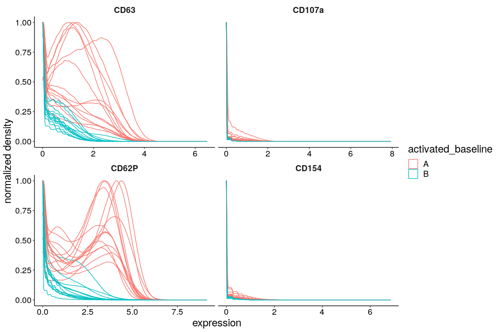<!-- -->

``` r
DR_methods <- c("UMAP","PCA")

for( method in DR_methods ){
  print(method)
  sce <- runDimRed(sce, method, cells_chosen = 1000, feature_chosen = "type", assay_chosen = "exprs", scale = T, k = 3)
}
```

    ## [1] "UMAP"
    ## [1] "PCA"

    ## Warning in check_numbers(k = k, nu = nu, nv = nv, limit = min(dim(x)) - : more
    ## singular values/vectors requested than available

    ## Warning in (function (A, nv = 5, nu = nv, maxit = 1000, work = nv + 7, reorth =
    ## TRUE, : You're computing too large a percentage of total singular values, use a
    ## standard svd instead.

    ## Warning in (function (A, nv = 5, nu = nv, maxit = 1000, work = nv + 7, reorth
    ## = TRUE, : did not converge--results might be invalid!; try increasing work or
    ## maxit

``` r
state_markers <- rowData(sce)[rowData(sce)$marker_class=="state",]$marker_name
for( method in DR_methods ){
  g <- CATALYST::plotDR(sce, dr = method, color_by = state_markers, facet_by="activated_baseline") +  theme(text = element_text(size=18))
  print(g)
}
```

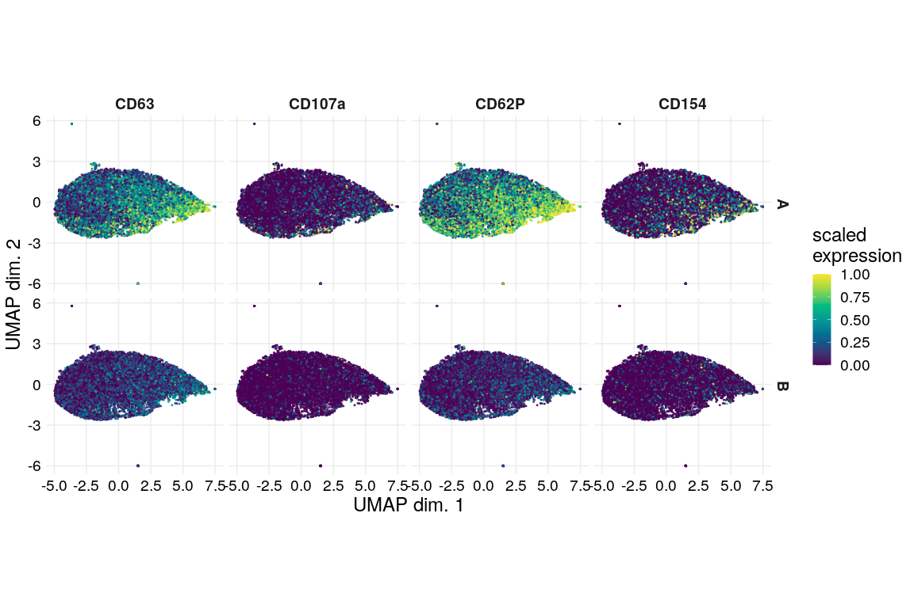<!-- -->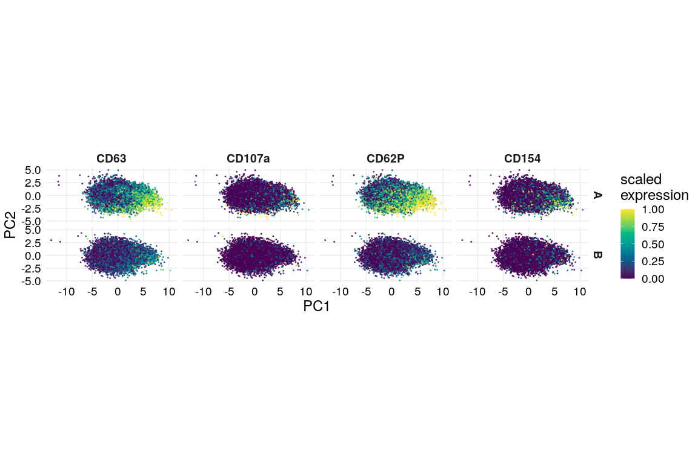<!-- -->

``` r
for( method in DR_methods ){
  print(method)
  sce <- runDimRed(sce, method, cells_chosen = 1000, feature_chosen = "state", assay_chosen = "exprs", scale = T, k = 3)
}
```

    ## [1] "UMAP"
    ## [1] "PCA"

    ## Warning in check_numbers(k = k, nu = nu, nv = nv, limit = min(dim(x)) - : more
    ## singular values/vectors requested than available

    ## Warning in (function (A, nv = 5, nu = nv, maxit = 1000, work = nv + 7, reorth =
    ## TRUE, : You're computing too large a percentage of total singular values, use a
    ## standard svd instead.

``` r
for( method in DR_methods ){
  g <- CATALYST::plotDR(sce, dr = method, color_by = "activated_baseline", facet_by="dual_triple") +  theme(text = element_text(size=18))
  print(g)
}
```

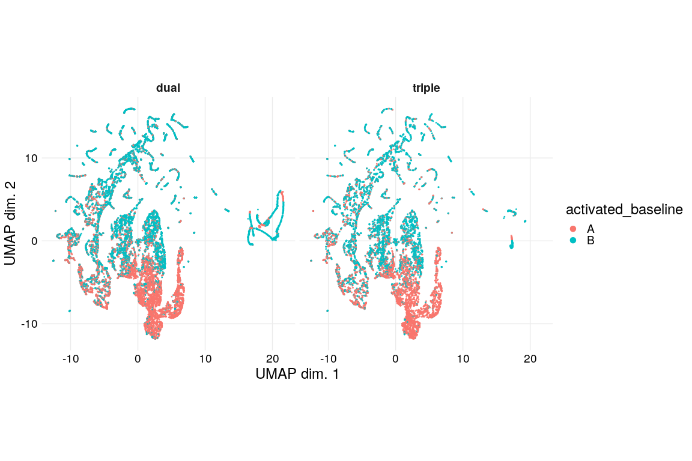<!-- -->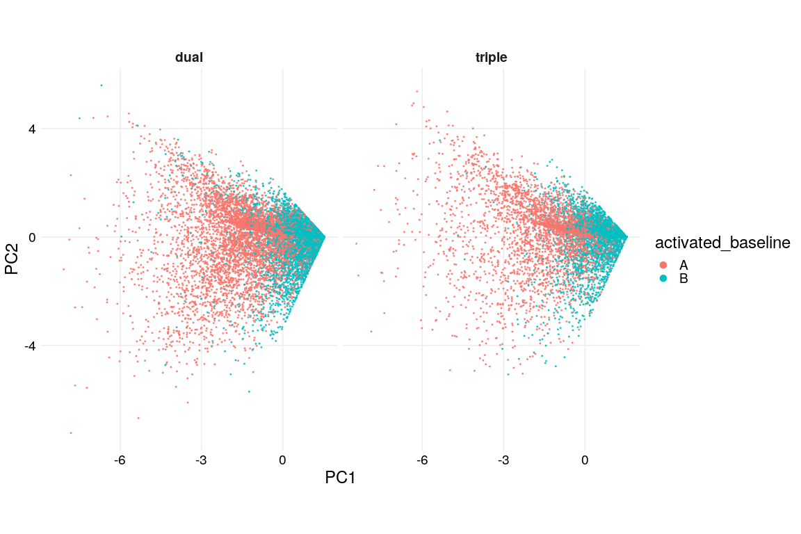<!-- -->
The state markers shown in the plots are the activation markers of
platelets and are known to be differently expressed in activated and
baseline samples. The markers CD63 and CD620 are higher expressed in A
than in B samples. Markers CD107a and CD154 are much lower expressed
than the other two, but however one can see a small difference between
both conditions.

Let’s move on to the comparison of activated/baseline in patients
receiving dual antiplatelet therapy.

## 2.1 Dual Activated vs. Dual Baseline

First, we have to filter the data to only have dual patients.

``` r
sce_d <- filterSCE(sce, dual_triple == "dual")

# set none markers to state in order to be able to include them in the analysis (for LMM and limma)
rowData(sce_d)$marker_class <- rowData(sce_d)$marker_class[rowData(sce_d)$marker_class == "none"] <- "state"
```

Before performing the differential marker expression analysis, the
median marker expressions are
plotted.

``` r
CATALYST::plotPbExprs(sce_d, k = "all", features = NULL , color_by = "activated_baseline",  ncol=8, facet_by = "antigen") +  theme(text = element_text(size=16))
```

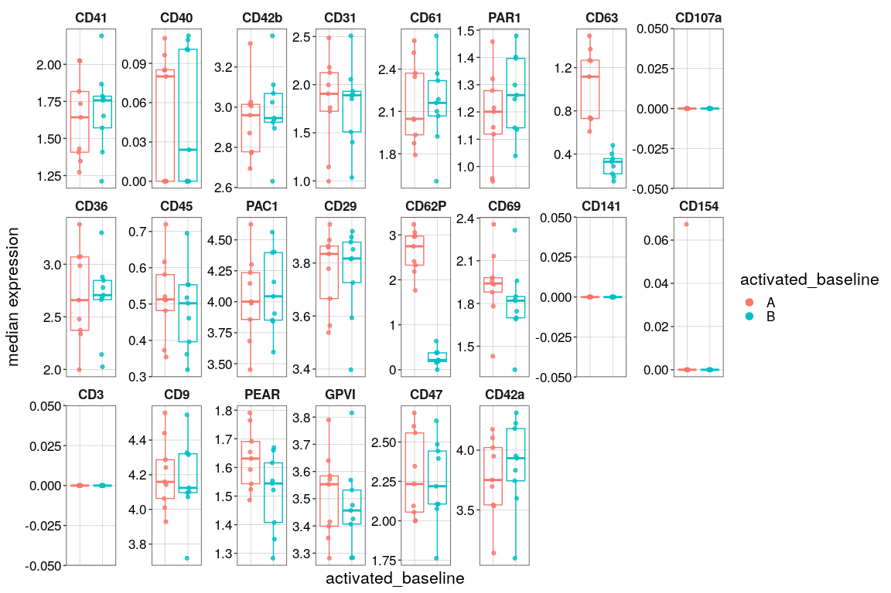<!-- -->
Comparing both conditions in dual patients, the state markers CD62P and
CD63 show highest difference in median marker expression between A and
B. Additionally, one could expect to find a significance for the PEAR
marker. Taking a brief look at the other two state markers, CD107a and
CD154, the median is not the right way to plot them because they are
very high zero inflated.

Finally, the differential analysis can be performed using the linear
mixed effect models of CATALYST.

``` r
res_d <- runDS(sce = sce_d,
      condition = "activated_baseline",
      de_methods = c("LMM"),
      k = "all",
      features = "all",
      markers_to_test = "all",
      random_effect = "patient_id"
      )
```

    ## Using LMM

    ## Warning in any(lapply(contrastVars, function(y) {: coercing argument of type
    ## 'list' to logical
    
    ## Warning in any(lapply(contrastVars, function(y) {: coercing argument of type
    ## 'list' to logical

    ##      [,1]
    ## [1,]    0
    ## [2,]    1

    ## using SingleCellExperiment object from CATALYST as input

    ## using cluster IDs from clustering stored in column 'all' of 'cluster_codes' data frame in 'metadata' of SingleCellExperiment object from CATALYST

    ## calculating features...

    ## calculating DS tests using method 'diffcyt-DS-LMM'...

    ## Warning in checkConv(attr(opt, "derivs"), opt$par, ctrl = control$checkConv, :
    ## Model failed to converge with max|grad| = 0.0740974 (tol = 0.002, component 1)

    ## Warning in checkConv(attr(opt, "derivs"), opt$par, ctrl = control$checkConv, :
    ## Model failed to converge with max|grad| = 0.32685 (tol = 0.002, component 1)

    ## Warning in checkConv(attr(opt, "derivs"), opt$par, ctrl = control$checkConv, : Model is nearly unidentifiable: very large eigenvalue
    ##  - Rescale variables?

    ## Warning in checkConv(attr(opt, "derivs"), opt$par, ctrl = control$checkConv, :
    ## Model failed to converge with max|grad| = 0.314792 (tol = 0.002, component 1)

    ## Warning in checkConv(attr(opt, "derivs"), opt$par, ctrl = control$checkConv, :
    ## Model failed to converge with max|grad| = 0.0276216 (tol = 0.002, component 1)

    ## Warning in checkConv(attr(opt, "derivs"), opt$par, ctrl = control$checkConv, :
    ## Model failed to converge with max|grad| = 0.00670507 (tol = 0.002, component 1)

    ## Warning in vcov.merMod(model): Computed variance-covariance matrix problem: not a positive definite matrix;
    ## returning NA matrix

    ## Error in asMethod(object) : not a positive definite matrix

    ## Warning in checkConv(attr(opt, "derivs"), opt$par, ctrl = control$checkConv, :
    ## Model failed to converge with max|grad| = 0.0131952 (tol = 0.002, component 1)

    ## Warning in checkConv(attr(opt, "derivs"), opt$par, ctrl = control$checkConv, :
    ## Model failed to converge with max|grad| = 0.165808 (tol = 0.002, component 1)

    ## Warning in checkConv(attr(opt, "derivs"), opt$par, ctrl = control$checkConv, :
    ## Model failed to converge with max|grad| = 0.388005 (tol = 0.002, component 1)

    ## Warning in checkConv(attr(opt, "derivs"), opt$par, ctrl = control$checkConv, :
    ## Model failed to converge with max|grad| = 0.0803469 (tol = 0.002, component 1)

    ## boundary (singular) fit: see ?isSingular

    ## Warning in checkConv(attr(opt, "derivs"), opt$par, ctrl = control$checkConv, :
    ## Model failed to converge with max|grad| = 0.0053748 (tol = 0.002, component 1)

    ## Warning in vcov.merMod(model): Computed variance-covariance matrix problem: not a positive definite matrix;
    ## returning NA matrix

    ## Error in asMethod(object) : not a positive definite matrix

    ## Warning in checkConv(attr(opt, "derivs"), opt$par, ctrl = control$checkConv, :
    ## Model failed to converge with max|grad| = 0.00623776 (tol = 0.002, component 1)

    ## Warning in checkConv(attr(opt, "derivs"), opt$par, ctrl = control$checkConv, : Model is nearly unidentifiable: very large eigenvalue
    ##  - Rescale variables?

    ## Warning in vcov.merMod(model): Computed variance-covariance matrix problem: not a positive definite matrix;
    ## returning NA matrix

    ## Error in asMethod(object) : not a positive definite matrix

    ## Warning in checkConv(attr(opt, "derivs"), opt$par, ctrl = control$checkConv, :
    ## Model failed to converge with max|grad| = 0.079001 (tol = 0.002, component 1)

    ## Warning in checkConv(attr(opt, "derivs"), opt$par, ctrl = control$checkConv, :
    ## Model failed to converge with max|grad| = 0.0214092 (tol = 0.002, component 1)

    ## Warning in checkConv(attr(opt, "derivs"), opt$par, ctrl = control$checkConv, :
    ## Model failed to converge with max|grad| = 0.0262987 (tol = 0.002, component 1)

    ## Warning in checkConv(attr(opt, "derivs"), opt$par, ctrl = control$checkConv, :
    ## Model failed to converge with max|grad| = 0.0119357 (tol = 0.002, component 1)

``` r
CATALYST::plotDiffHeatmap(sce_d, rowData(res_d$LMM$res), all=T, col_anno = c("activated_baseline", "patient_id"), normalize = TRUE)
```

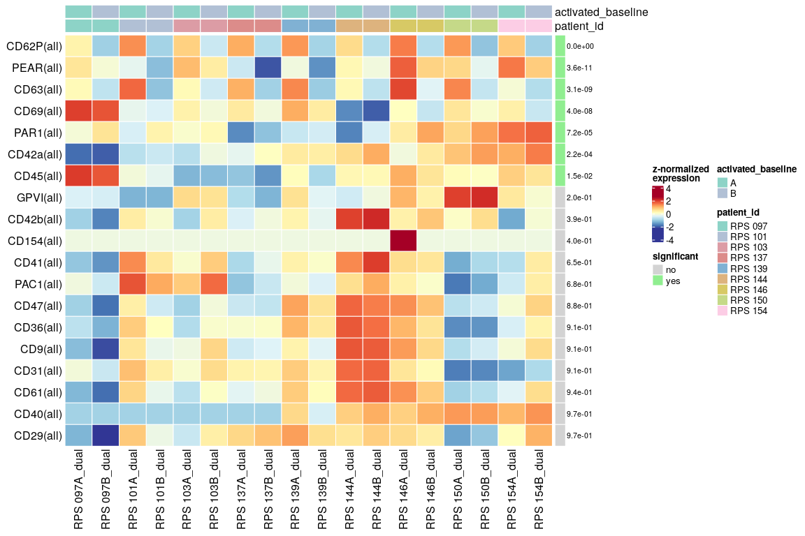<!-- -->
Running the linear mixed model with taking into account the patient id
as random affect, the model sees 7 significant markers between dual
activated and dual baseline. Some of them are type markers which are
interesting for further investigation.

## 2.2 Triple Activated vs. Triple Baseline

Comparing now activated vs. baseline in triple patients:

``` r
sce_t <- filterSCE(sce, dual_triple == "triple")
# set none markers to state in order to be able to include them in the analysis (for LMM and limma)
rowData(sce_t)$marker_class <- rowData(sce_t)$marker_class[rowData(sce_t)$marker_class == "none"] <- "state"

CATALYST::plotPbExprs(sce_t, k = "all", features = NULL , color_by = "activated_baseline",  ncol=8, facet_by = "antigen") +  theme(text = element_text(size=16))
```

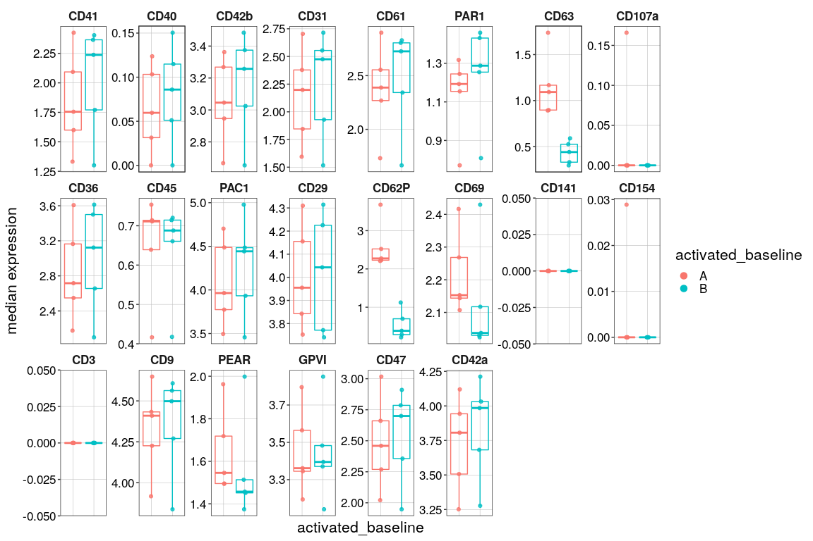<!-- -->

``` r
res_t <- runDS(sce = sce_t,
      condition = "activated_baseline",
      de_methods = c("LMM"),
      k = "all",
      features = "all",
      random_effect = "patient_id"
      )
```

    ## Using LMM

    ## Warning in any(lapply(contrastVars, function(y) {: coercing argument of type
    ## 'list' to logical
    
    ## Warning in any(lapply(contrastVars, function(y) {: coercing argument of type
    ## 'list' to logical

    ##      [,1]
    ## [1,]    0
    ## [2,]    1

    ## using SingleCellExperiment object from CATALYST as input

    ## using cluster IDs from clustering stored in column 'all' of 'cluster_codes' data frame in 'metadata' of SingleCellExperiment object from CATALYST

    ## calculating features...

    ## calculating DS tests using method 'diffcyt-DS-LMM'...

    ## Warning in checkConv(attr(opt, "derivs"), opt$par, ctrl = control$checkConv, :
    ## Model failed to converge with max|grad| = 0.0608767 (tol = 0.002, component 1)

    ## Warning in checkConv(attr(opt, "derivs"), opt$par, ctrl = control$checkConv, :
    ## Model failed to converge with max|grad| = 0.0113597 (tol = 0.002, component 1)

    ## Warning in checkConv(attr(opt, "derivs"), opt$par, ctrl = control$checkConv, :
    ## Model failed to converge with max|grad| = 0.00701236 (tol = 0.002, component 1)

    ## Warning in checkConv(attr(opt, "derivs"), opt$par, ctrl = control$checkConv, :
    ## Model failed to converge with max|grad| = 0.00722263 (tol = 0.002, component 1)

    ## Warning in checkConv(attr(opt, "derivs"), opt$par, ctrl = control$checkConv, :
    ## Model failed to converge with max|grad| = 0.012285 (tol = 0.002, component 1)

    ## Warning in checkConv(attr(opt, "derivs"), opt$par, ctrl = control$checkConv, :
    ## Model failed to converge with max|grad| = 0.0077505 (tol = 0.002, component 1)

    ## Warning in checkConv(attr(opt, "derivs"), opt$par, ctrl = control$checkConv, :
    ## Model failed to converge with max|grad| = 0.00555081 (tol = 0.002, component 1)

    ## Warning in checkConv(attr(opt, "derivs"), opt$par, ctrl = control$checkConv, :
    ## Model failed to converge with max|grad| = 0.0214399 (tol = 0.002, component 1)

    ## Warning in checkConv(attr(opt, "derivs"), opt$par, ctrl = control$checkConv, :
    ## Model failed to converge with max|grad| = 0.11496 (tol = 0.002, component 1)

    ## Warning in checkConv(attr(opt, "derivs"), opt$par, ctrl = control$checkConv, :
    ## Model failed to converge with max|grad| = 0.00429264 (tol = 0.002, component 1)

    ## Warning in checkConv(attr(opt, "derivs"), opt$par, ctrl = control$checkConv, :
    ## Model failed to converge with max|grad| = 0.0247593 (tol = 0.002, component 1)

    ## Warning in vcov.merMod(model): Computed variance-covariance matrix problem: not a positive definite matrix;
    ## returning NA matrix

    ## Error in asMethod(object) : not a positive definite matrix

    ## Warning in vcov.merMod(model): Computed variance-covariance matrix problem: not a positive definite matrix;
    ## returning NA matrix

    ## Error in asMethod(object) : not a positive definite matrix

    ## Warning in checkConv(attr(opt, "derivs"), opt$par, ctrl = control$checkConv, :
    ## Model failed to converge with max|grad| = 0.0423041 (tol = 0.002, component 1)

    ## Warning in checkConv(attr(opt, "derivs"), opt$par, ctrl = control$checkConv, :
    ## Model failed to converge with max|grad| = 0.0293441 (tol = 0.002, component 1)

    ## Warning in checkConv(attr(opt, "derivs"), opt$par, ctrl = control$checkConv, :
    ## Model failed to converge with max|grad| = 0.00374034 (tol = 0.002, component 1)

    ## Warning in checkConv(attr(opt, "derivs"), opt$par, ctrl = control$checkConv, :
    ## Model failed to converge with max|grad| = 0.0237774 (tol = 0.002, component 1)

``` r
CATALYST::plotDiffHeatmap(sce_t, rowData(res_t$LMM$res), all=T, col_anno = c("activated_baseline", "patient_id"), normalize = TRUE)
```

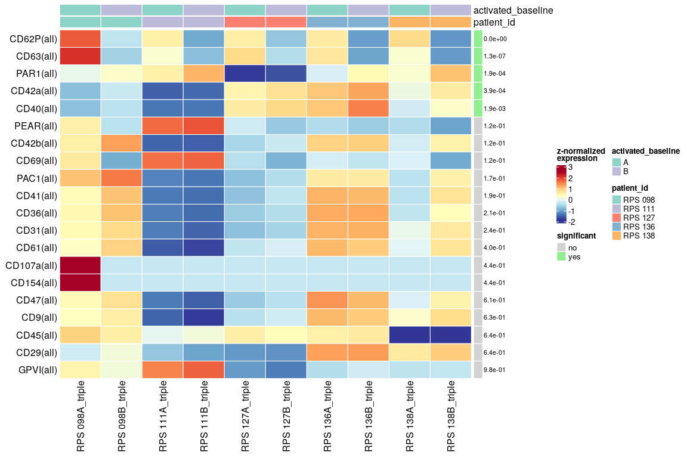<!-- -->
Performing the same analysis on the triple patients, we can again
recognize both state markers to have highest difference between A and B.
The linear mixed effect model found in the triple patients little less
significant markers.

# 3\. Dual vs. Triple

Finally, we should analyze the difference of dual and triple therapy.

``` r
DR_methods <- c("UMAP","PCA")

for( method in DR_methods ){
  print(method)
  sce <- runDimRed(sce, method, cells_chosen = 1000, feature_chosen = "type", assay_chosen = "exprs", scale = T, k = 3)
}

for( method in DR_methods ){
  g <- CATALYST::plotDR(sce, dr = method, color_by = "dual_triple", facet_by="activated_baseline") +  theme(text = element_text(size=18))
  print(g)
}
```

This UMAP and PCA show that the cells can’t get clustered very well for
dual and triple patients.

## 3.1 Dual Activated vs. Triple Activated

First, we have to filter the patients for only activated samples.

``` r
sce_a <- filterSCE(sce, activated_baseline == "A")
rowData(sce_a)$marker_class <- rowData(sce_a)$marker_class[rowData(sce_a)$marker_class == "none"] <- "state"

CATALYST::plotPbExprs(sce_a, k = "all", features = NULL , color_by = "dual_triple",  ncol=8, facet_by = "antigen") +  theme(text = element_text(size=16))
```

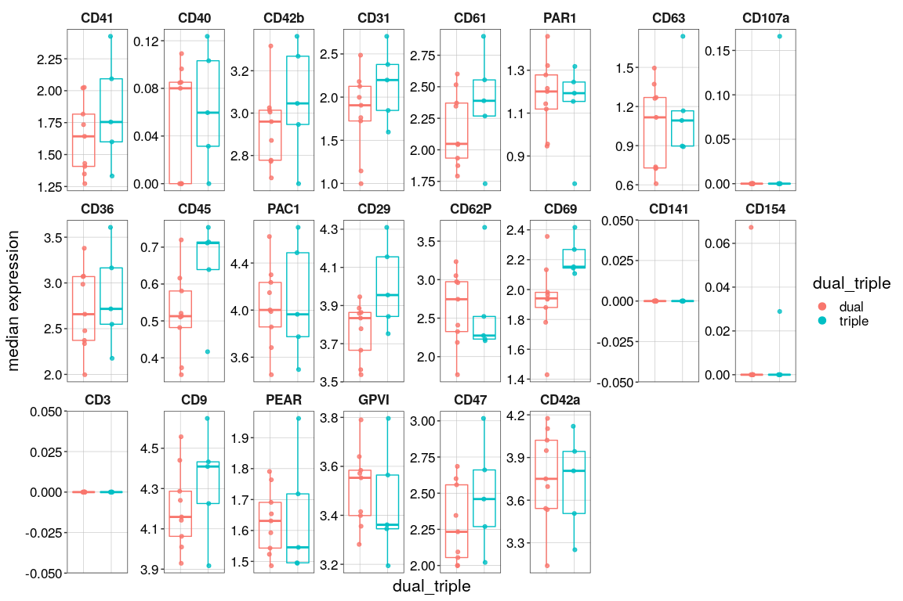<!-- -->

``` r
res_a <- runDS(sce = sce_a,
      condition = "dual_triple",
      de_methods = c("LMM"),
      k = "all",
      features = "all"
      )
```

    ## Using LMM

    ## Warning in any(lapply(contrastVars, function(y) {: coercing argument of type
    ## 'list' to logical
    
    ## Warning in any(lapply(contrastVars, function(y) {: coercing argument of type
    ## 'list' to logical

    ##      [,1]
    ## [1,]    0
    ## [2,]    1

    ## using SingleCellExperiment object from CATALYST as input

    ## using cluster IDs from clustering stored in column 'all' of 'cluster_codes' data frame in 'metadata' of SingleCellExperiment object from CATALYST

    ## calculating features...

    ## calculating DS tests using method 'diffcyt-DS-LMM'...

    ## Warning in cov2cor(covm): diag(.) had 0 or NA entries; non-finite result is
    ## doubtful

    ## Warning in cov2cor(covm): diag(.) had 0 or NA entries; non-finite result is
    ## doubtful

``` r
CATALYST::plotDiffHeatmap(sce_a, rowData(res_a$LMM$res), all=T, col_anno = c("dual_triple"), normalize = TRUE)
```

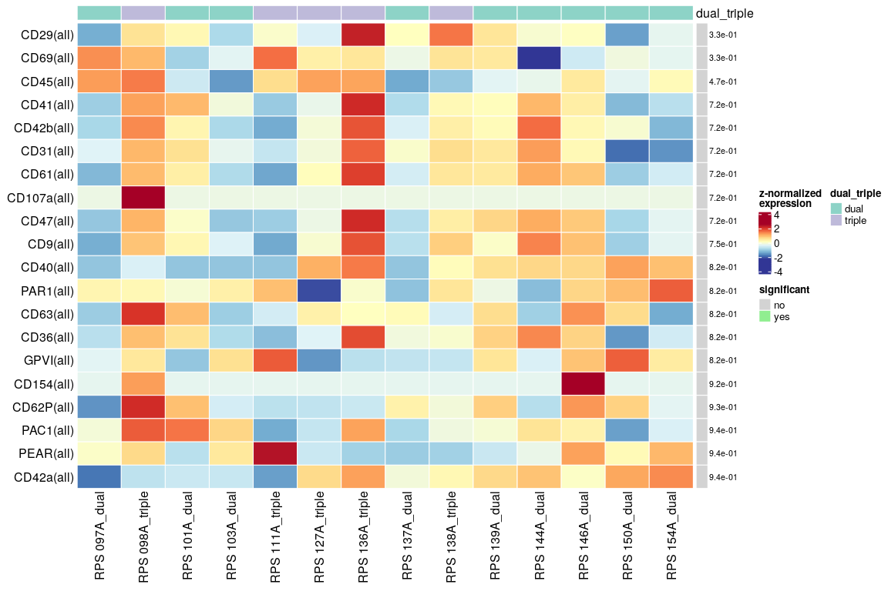<!-- -->

## 3.2 Dual Baseline vs. Triple Basleline

``` r
sce_b <- filterSCE(sce, activated_baseline == "B")
rowData(sce_b)$marker_class <- rowData(sce_b)$marker_class[rowData(sce_b)$marker_class == "none"] <- "state"

CATALYST::plotPbExprs(sce_b, k = "all", features = NULL , color_by = "dual_triple",  ncol=8, facet_by = "antigen") +  theme(text = element_text(size=16))
```

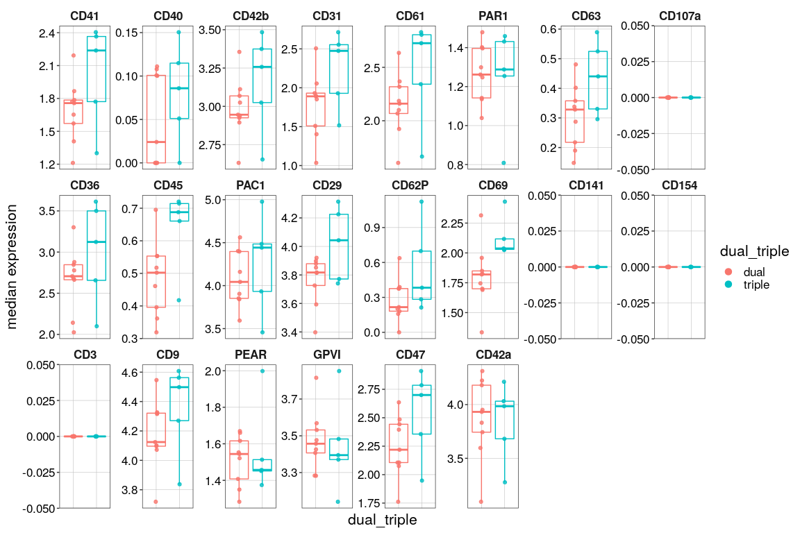<!-- -->

``` r
res_b <- runDS(sce = sce_b,
      condition = "dual_triple",
      de_methods = c("LMM"),
      k = "all",
      features = "all",
      )
```

    ## Using LMM

    ## Warning in any(lapply(contrastVars, function(y) {: coercing argument of type
    ## 'list' to logical
    
    ## Warning in any(lapply(contrastVars, function(y) {: coercing argument of type
    ## 'list' to logical

    ##      [,1]
    ## [1,]    0
    ## [2,]    1

    ## using SingleCellExperiment object from CATALYST as input

    ## using cluster IDs from clustering stored in column 'all' of 'cluster_codes' data frame in 'metadata' of SingleCellExperiment object from CATALYST

    ## calculating features...

    ## calculating DS tests using method 'diffcyt-DS-LMM'...

    ## Warning in cov2cor(covm): diag(.) had 0 or NA entries; non-finite result is
    ## doubtful

    ## Warning in cov2cor(covm): diag(.) had 0 or NA entries; non-finite result is
    ## doubtful
    
    ## Warning in cov2cor(covm): diag(.) had 0 or NA entries; non-finite result is
    ## doubtful
    
    ## Warning in cov2cor(covm): diag(.) had 0 or NA entries; non-finite result is
    ## doubtful

``` r
CATALYST::plotDiffHeatmap(sce_b, rowData(res_b$LMM$res), all=T, col_anno = c("dual_triple"), normalize = TRUE)
```

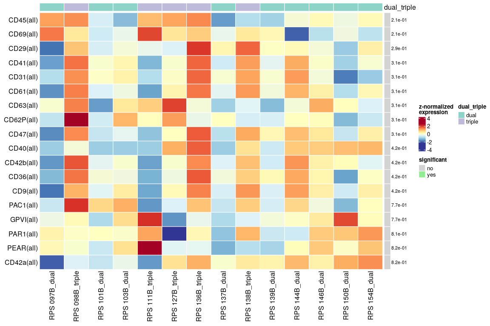<!-- -->

We could not find any significant markers for activated platelets in
dual and triple as well as for the baseline platelets. This means that
we cannot see any biological change in dual and triple therapy. So the
third anticoagulant doesn’t seem to have any effect on the marker
expression.

# 4\. Conclusion

  - Activated and baseline platelet show significant differences in dual
    and triple patients:
      - state markers (control): CD62P, CD63
      - other markers: PAR1, CD42a, PEAR (dual), CD69 (dual), CD45
        (dual), CD40 (triple)
  - No significant differences for dual vs. triple anticoagulation
    therapy
  - Outlook:
      - examine subgroups of platelets and define platelet
        subpopulations
      - pool therapies in further analysis

# 5\. Quick Overview of the Functions of the Significant Markers

  - CD63 -\> platelet activation marker
  - CD62P -\> platelet activation marker & platelet-leukocyte
    interactions
  - CD42a -\> platelet leukocyte interactions & platelet aggregation
    (subunit of Van Willibrand factor) ⇒ interaction of GPIb-IX-V with
    VWF initiates platelet adhesion
  - PEAR -\> platelet aggregation
  - PAR1 -\> thrombin receptor → platelet activation processes
    surprisingly low expressed in A samples probably too high dose of
    TRAP → PAR4 more involved in platelet activation
  - CD69 -\> signal transmitter receptor in platelets & involved in
    platelet activation processes
  - CD45 -\> leukocyte type marker → to certain extend also in platelets
  - CD40 -\> receptor for state marker CD154 → probably no correlation
    (too low expressed)
